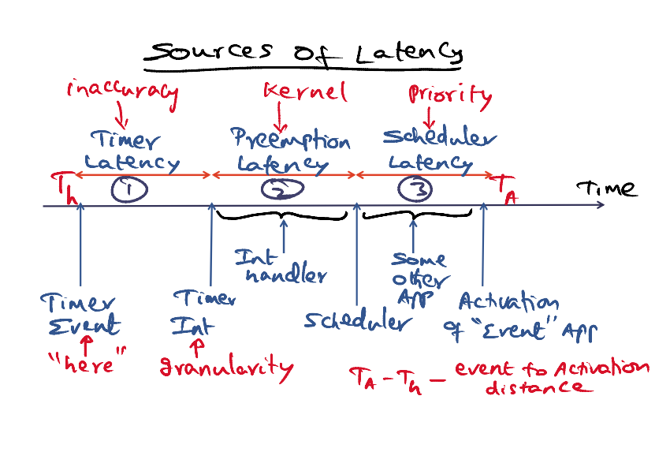
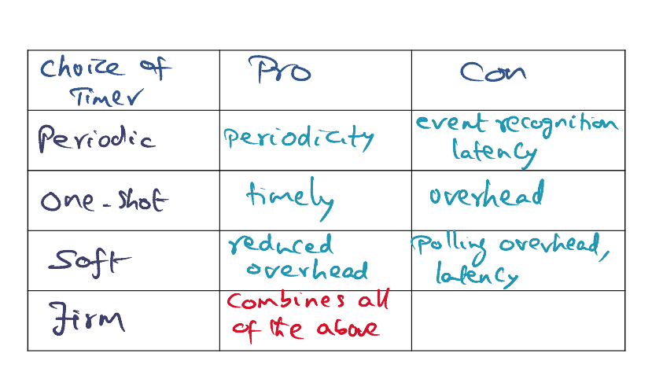
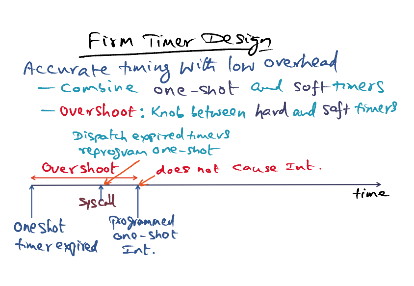
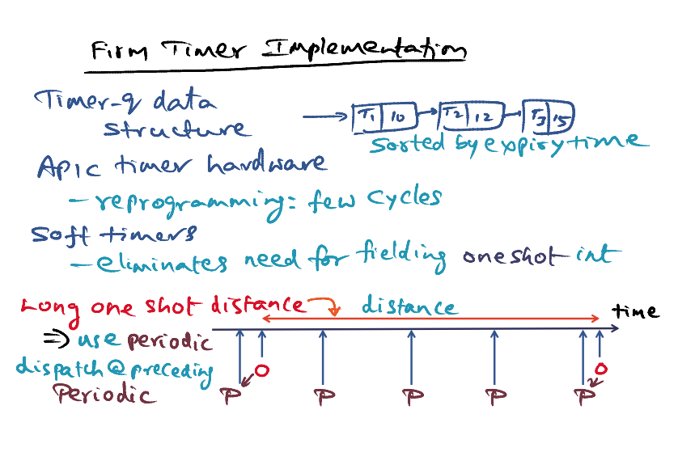
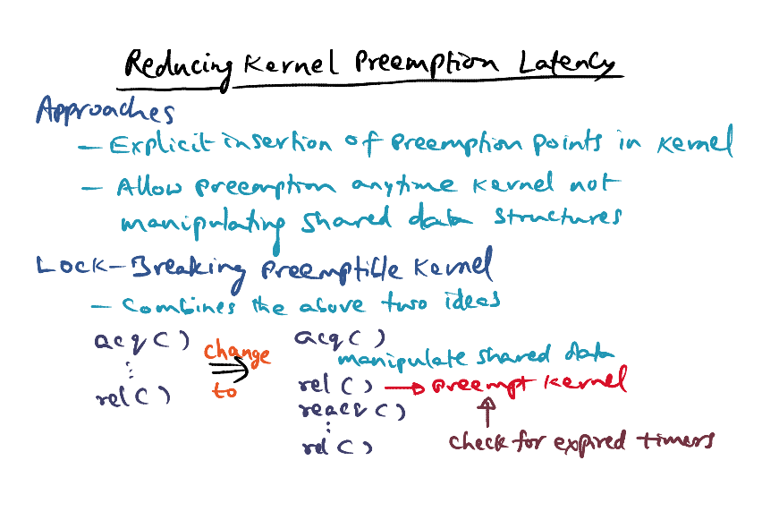
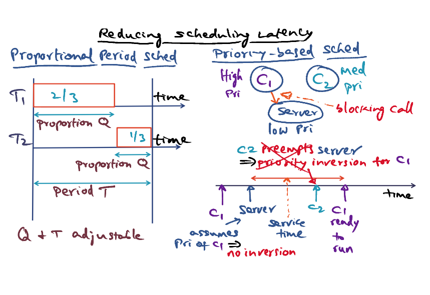

# TS-Linux

Time-sensitive Linux

### Sources of Latency

1. Timer latency
   - Due to granularity of timer (10ms for periodic timer)
2. Preemption Latency
   - Interrupt happen when kernel is doing something else (e.g. handling another higher priority interrupt), so kernel cannot be preempted yet
3. Scheduler latency
   - Some other higher priority app is running 

- Event to activation distance: TA [event activation] - Th [event happen]

### Timers Available

- **Periodic Timer**: Interrupted at interval. Maximum timer latency = the period itself 

- **One shot timer**: Exact timers. Programmed to be interrupted at exactly the time you want. Overhead for fielding the interrupt. 
- **Soft timer**: No timer interrupt (reduced overhead). OS polls at strategic times (i.e. during system calls/network packet arrival as trigger) for any event that require attention. 

- **Firm timer**: Combines all advantages of the above

### Firm Timer Design 

- Provide accurate timing with low overhead
- Combine **one-shot** and **soft** timers
- **Overshoot** knob between hard and soft timers
  - Overshoot = Programmed one-shot interrupt - Oneshot timer expired 
  - Between the overshoot, it can be system calls/interrupts that can bring you into the kernel
  - During syscall, dispatch expired timers & reprogram the one-shot

- At the point where the time when the timer is programmed for one-shot interrupt, it does not cause another interrupt anymore. => We managed to avoid fielding the one-shot interrupt

### Firm Timer Implementation

- Task = Schedulable entities
- Timer-q data structure: task & expiry times
- APIC: reprogramming a one-shot timer is only a few cycles
- When APIC timer expires, the scheduler will find the task in timer-q that expires, it will call the interrupt handler if expires
- The expired entries will be removed from the timer-q data structrue
- If the entry corresponds to a periodic timer, the timer will re-enqueue the entry after updating the expiry
- If it is a one-shot timer, the interrupt handler will reprograms the task for the next one-shot event
- APIC timer hardware: program the register that decrements on every bus cycle
- Choose overshoot parameter: soft timers
- **Long one shot distance** => Possible that several periodic events will go off in the one shot interval
  - **Use periodic**: dispatch the one-shot event at the preceeding periodic (processing a bit earlier is ok)
  - Then reprogram the one-shot event to go off at the next one-shot event
  - Periodic: O(1), One-shot: O(lg(n)) where n is the number of active timers

- Summary: 
  - APIC timer hardware allows to reprogram the timer within few cycles
  - Choose appropriate overshoot distance, we can avoid fielding the interrupts using soft timer
  - If the one shot distance is long, we can use periodic and distpatch at preceeding periodic timer

### Reducing Kernel Preemption Latency

### Reducing Scheduling Latency  

- **Propotional Period Scheduling** 
  - Q & T adjustable
  - For <u>admission control</u>
  - Provide temporal protection
  - While supporting timeliness of time sensitive task, the ts-linux can reserve a portion to run throughput oriented tasks. 
- **Priority-based Scheduling** 
  - C1 make a blocking call to a low priority server, server will execute. C2 (higher priority than server) can continue to run. C2 will continue run.  => Priority inversion
  - We need the server will assume priority of C1, so that C2 will not be able to run. => no inversion

### Conclusion

- 3 sources of latency: timer latency, kernel preemption latency, scheduling latency

