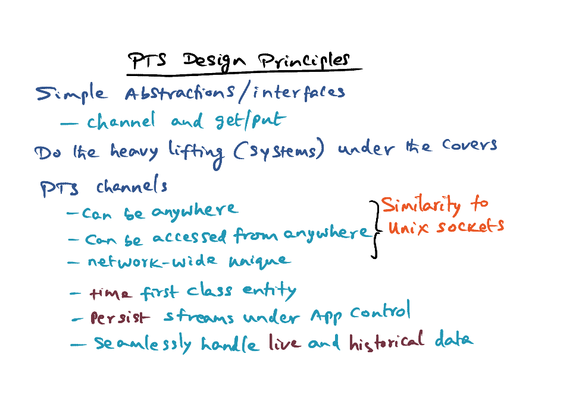

# Persistent Temporal Streams

### Programming Paradigms

- In conventional distributed program, sockets is being used, with RPC packages built on top of them for distributed I/O
- Socket API is too low level and insufficient semantics richness for emerging novel multimedia distributed applications

### Novel Multimedia Apps

- Sensor based (cameras, radars, microphones)

- Sensors are distributed

- Live stream analysis => Situation awareness applications

- A control loop:

  - Sense
  - Prioritization of sense 
  - Processing the senses streams
  - Take some actions => actuating sensors, software, human, etc
  - Feedback to sensors to retarget

  

- Real-time properties => we have to shrink the time latency between sense and actuation

- Example: monitoring activities in the airport
  - Normal actions is ok, anomalies should be reported
  - Cameras to analyse the streams
  - Problems: 
    - Infrastructure overhead => we have to prune the senses at the source
    - Cognitive overhead 
    - False positives and False negatives 
- Lessons: 
  - Simplicity is the key
  - Propagating temporal causality
  - Live data & correlation to history data

### Programming Model for Situation Awareness

- Sequential program for video analytics
  - Camera --> detect --> tracking --> recognition --> alarm 

- Objective: process the streams for high level inferences
- Systems come in with programming models: <u>PTS</u>

### PTS Programming Model

- In a distributed applications, threads and channels are the high level abstraction provided in the PTS programming model.
- Computation graph ~= UNIX process sockets graph
- Semantics: 
  - Channel holds time-sequence data objects
  - Multiple producers of data goes into a channel
  - Multiple consumers consumes from the channel
  - Channel allows many to many connections
  - `Put (item, <timestamp>)`
  - `get(<LB>, <UB>)` 
    - LB/UB lower/upper bound of timestamp -> the thread will get back all the items the channel contains within the LB and UB
    - Can specify to obtain oldest/newest item
- **Temporal causality** propagated through the graph. 
- In situation awareness applications, computation needs to use data from several different streams, and make inference from composite with several streams 

### Bundling Streams

- Computations need to get senses from multiple modality of sensing to generate inferences that are more robust
- PTS allow senses to be grouped as a stream group
- An anchor stream, others are dependent streams on the anchor stream
- `groupget` primitive

### Power of Simplicity is the Key for Adoption

- use `get`/`put` semantics & channel abstractions to convert sequential program to distributed program
- Camera Capture --> **frames** --> detection --> **blobs** (characterise the objects it detected) --> tracking --> **objects** --> recognition -->  **events** --> alarm 

### PTS Design Principles

- Simple abstractions/interfaces: channels, get/put
- Heavy lifting are all managed under the core
- PTS channels: 
  - Can be anywhere
  - Can be accessed anywhere
  - Network-wide unique
  - **Time** as first class entity => time is manipulatable (time indexable in channels)
  - **Persist** streams under app control => archive the streams into disks
  - Seamlessly handle **live** and **historical** data

### Persistent Channel Architecture

- All computations in applications are treated as producers or consumers of data
- **Producers put** data into system, consumers get data from system
- When producers put data into system, it produce a trigger (sent to live channel layer)
- **GC trigger** moves data that are ancient into the garbage list
- Garbage collection thread periodically clean up items in the garbage list
- When item go past the window that should be in the live channel layer, it creates a persist trigger
- 3 layer architecture: 
  - #1 Live channel layer: hold the items in the channel
    - Creator of channel can specify the semantics of the channel (e.g. keep only last 30 seconds of data in channel)
  - Interaction Layer
  - #2 Persistent Layer: Keep data as long as they want
    - Based on the persist layer, it takes item from the live channel layer, and the application can specify a **picking handler** (function)
    - e.g condense images into digest to be persisted
  - #3 Backend layer: application choice of which backend layer to store it
    - MySQL
    - UNIX file system
    - GPFS
- Get triggers can be passed from live channel, to persistent layer and backend. We can get historical data from backend layer. 

### Conclusion

PTS provides a simple programming model for programmers to perform live stream analysis applications. 