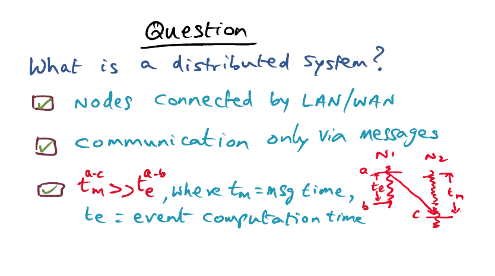
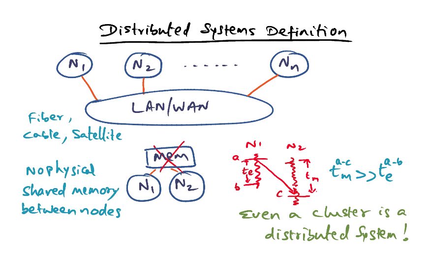
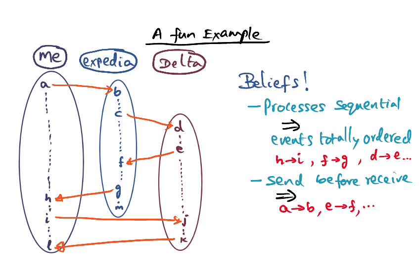
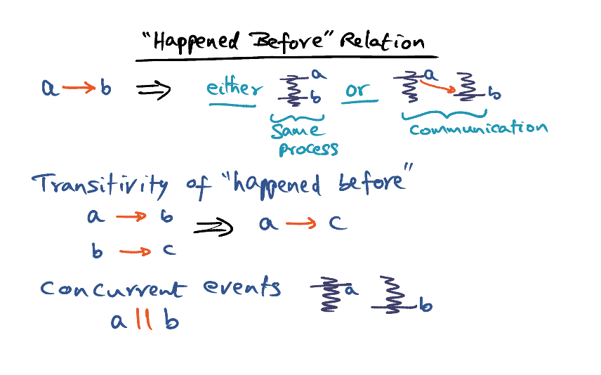
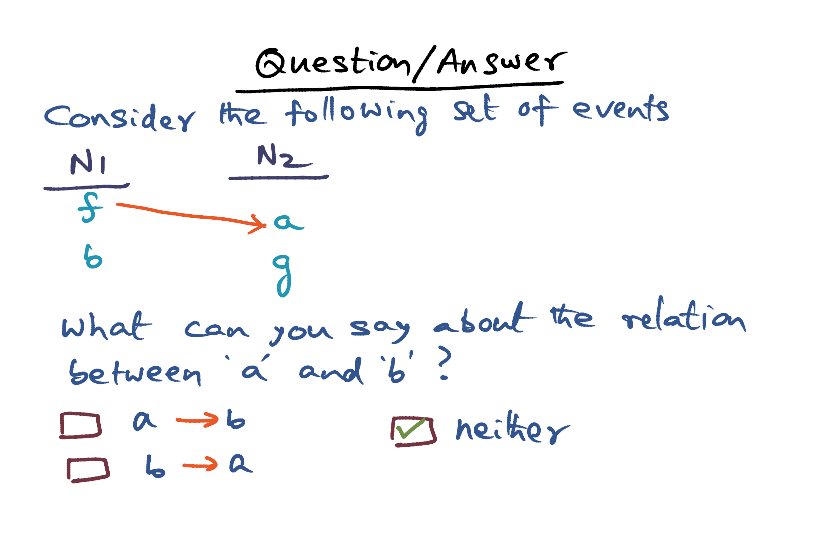
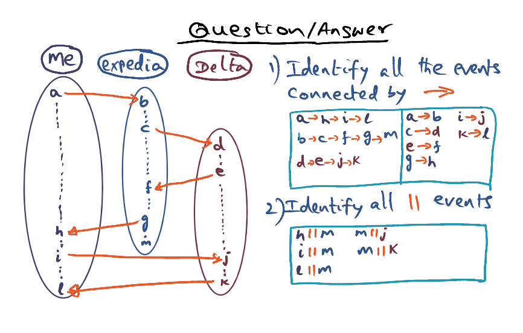
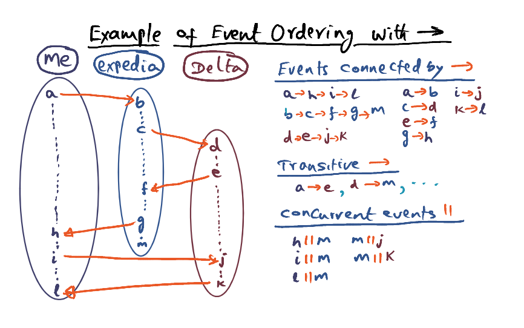

# Distributed Systems Basics

### Distributed Systems

- Collection of nodes interconnected by a LAN (twisted pair coaxial cabels, fibre optics) /WAN (satellites/microwave links) through ethernet/ATM
- No physicsl shared memory between nodes of distributed systems. They can only communicate via LAN/WAN. 
- Communication time/Messaging time is significantly larger than the Event communication time 

**<u>Lamport's Definition of Distributed Systems</u>**

A system is distributed if the message transmission time is not negligible compared to the time between events. 

-  Clusters is a distributed systems. 
- In structuring applications that run on distributed nodes, we have to ensure that the computation time is significantly larger than the communication time in order to reap the benefits of running it on a distributed system. 

### The Happen-Before Relation

Beliefs: 

- Events in a process happen sequentially 
- Send happens before Receive

#### Concurrent Events

- a and b are not events on the same process
- a and b does not have a send/receive relationship
- They are happen asynchronously between one another. 
- We cannot derive a total order for the a and b events, we can only get a partial order of it. 
- At one execution, a can happen before b, at other, b can happen before a. a and b are concurrent events. 

