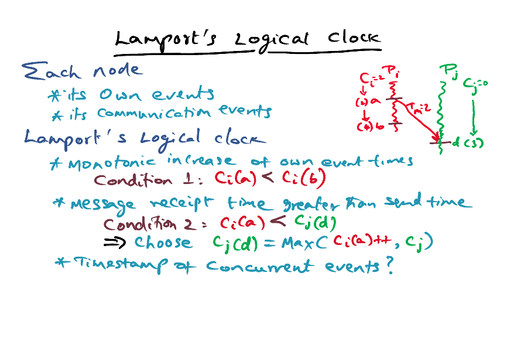
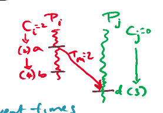
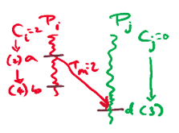
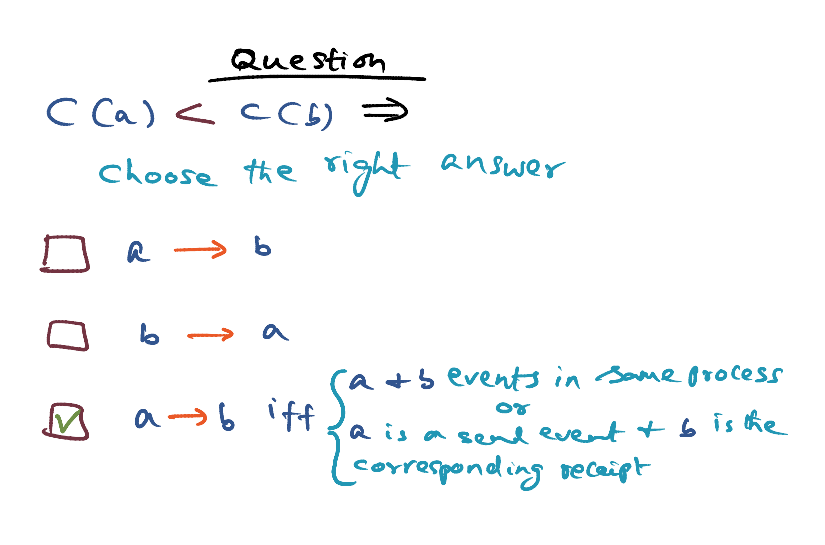
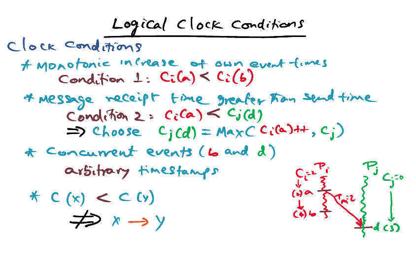
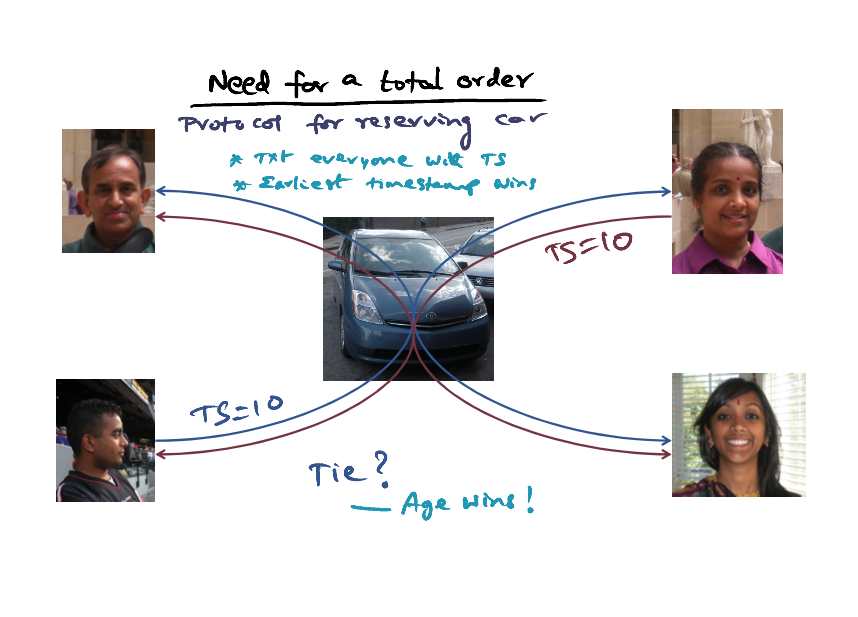
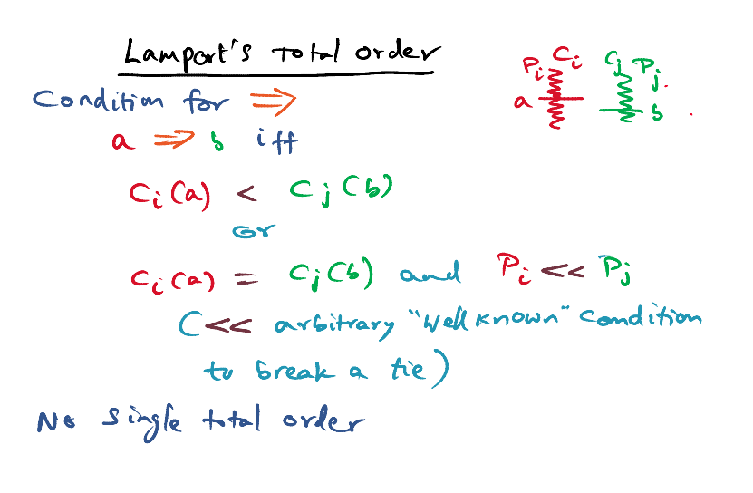

# Lamport's Clock

Reference: [Lamport, L., " Time, Clocks, and the Ordering of Events in a Distributed System ", Communications of the ACM, 21, 7, pgs. 558-565, July 1978.]

### Lamport's Logical Clock

- Each node knows it's own event. 
- Each node knows its communication events. 

#### Lamport's Logical Clock Conditions

- A <u>monotically increasing</u> local clock (any counters) of its own event times **(Events that happen in the same process)**

  - Condition 1: c_i (a) <  c_i (b)

- **Message receipt time is greater than send time** 

  - Condition 1: c_i (a) <  c_j (d)
  - c_j (d) = Max(c_i (a)++, c_j)

- **Concurrent Events** (b and d)

  - **Arbitrary** timestamps

  

  - c(x) < c(y) doesn't mean than x happen before y, i.e. x->y 

- Lamport's logical clock give us a <u>partial order</u> of all events that happen in a distributed system

### Need For a Total Order

Example: 

- A, B, C and D shares a car
- To request a car, we have to text everyone with the timestamp. Earliest timestamp wins. Everyone makes a local decisions. 
- If there is a tie => If timestamp is the same, age wins. 

### Lamport's Total Order

- Event a is on Pi, b is on Pj
- a => b only if 
  - ci(a) < cj (b), or
  - ci(a) = cj(b) and <Some arbitrary well known condition to break a tie> 

- There's no single total order. It depends on the arbitrary well-known condition
- We use timestamps to get a total order. Timestamps are meaningless once we get the total order.

Example

