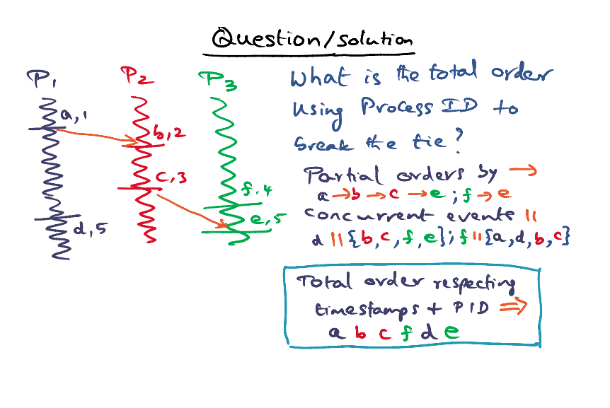

# Lamport's Clock

Reference: [Lamport, L., " Time, Clocks, and the Ordering of Events in a Distributed System ", Communications of the ACM, 21, 7, pgs. 558-565, July 1978.]

## Lamport's Logical Clock

- Each node knows it's own event. 
- Each node knows its communication events. 

### Lamport's Logical Clock Conditions

- A <u>monotically increasing</u> local clock (any counters) of its own event times **(Events that happen in the same process)**

  - Condition 1: c_i (a) <  c_i (b)

- **Message receipt time is greater than send time** 

  - Condition 1: c_i (a) <  c_j (d)
  - c_j (d) = Max(c_i (a)++, c_j)

- **Concurrent Events** (b and d)

  - **Arbitrary** timestamps

  

  - c(x) < c(y) doesn't mean than x happen before y, i.e. x->y 

- Lamport's logical clock give us a <u>partial order</u> of all events that happen in a distributed system

### Need For a Total Order

Example: 

- A, B, C and D shares a car
- To request a car, we have to text everyone with the timestamp. Earliest timestamp wins. Everyone makes a local decisions. 
- If there is a tie => If timestamp is the same, age wins. 

### Lamport's Total Order

- Event a is on Pi, b is on Pj
- a => b only if 
  - ci(a) < cj (b), or
  - ci(a) = cj(b) and <Some arbitrary well known condition to break a tie> 

- There's no single total order. It depends on the arbitrary well-known condition
- We use timestamps to get a total order. Timestamps are meaningless once we get the total order.

<u>Example</u>

- f needs to happen before e
- d should be before e or after e? 
  - break tie using PID
  - d and e are concurrent events
  - d ahead of e because PID P1 < P3

### Distributed Mutual Exclusion Lock Algorithm

- In shared memory multiprocessor, we use shared memory to implement the lock.
- We use Lamport's logical clock to implement a distributed mutual exclusion lock.
- Any process that needs to acquire the lock will send a message to other processes. 
- Every process has a private queue, that is ordered by the happen-before relationship. 

###### Request a lock

- To request a lock, the process will send the request, associated with the local timestamp as the request time, and send the mesage to all the peers. 
- The peers will put the request in the **local queue**. Every process will then **acknowlege** the request to its peers. 
- When there's a tie, we break the tie by giving the priority to the process that has a lower PID.
- The queues can be inconsistent. The time taken to traverse across the network can be different. 
- How to make a decision whether it has a lock (unambiguously)? 
- 
  - My request has to be on top of the queue. 
  - <u>**ACK** from all other nodes of the queue</u> OR <u>later lock requests</u>
    - ACK will have a later timestamp than the request
  - Even when Q1 has not received the ACK from Q2 and Qm, it can still proceed to lock because itg has received later lock requests from Q2 and Q3 (Pn, 5 and P2,10)

###### Releasing a Lock

- When process P1 wants to release the lock, P1 remove the entry from Q1, then P1 sends an unlock message to all other processes. 
- Peers received unlock mesage, they will remove the corresponding entries from their queues. 

###### Correctness

The correctness is based partially on the assumptions and partially on the construction of the Distributed ME Lock. 

- Fundamental assumptions: 

  - Messages arrive in order. Messages don't criss-cross. 

  - There is no loss of messages

### Message Complexity

- Answer: 3(N-1) 

<u>Message complexity of Mutual Exclusion Lock Algorithm</u> 

- There is N nodes in DS, and needs to send requests to N-1 nodes

- N-1 nodes replies ACK to node N

- Unlock primitives involves sending N-1 unlock messages to peers

  - Assumption that there is no loss of messages

- <u>Can we do better?</u> 

  As a receiving node of a lock request, if the lock requested is after my current lock request, we can defer the ACK until my unlock operation. => This can decrease the complexity to 2(N-1)

### Real World Scenario

- Logical clock is not sufficient. 
- Example: 
  - Local time in "your branch" is way ahead, local time in "my branch" is actual 5pm
  - The transaction is declined because the "your branch" local time is drifting from the actual real time. 
- Anomalies occur due to: 
  - Individual clock drift
  - Relative clock drift (Rate of clock tick is different from different processors)

## Lamport's Physical Clock

### Physical Clock Conditions 

In real time, event a happen before b. 

To guarantee this happen, there's 2 physical clock conditions:

- PC1 (bound on individual clock drift)
  - The absolute values of clock drift is very very small (negligible compared to IPC time).
- PC2 (Bound on mutual drift)
  - For all i, j, the difference between the drift in i and drift in j is very very small (negligible compared to IPC time)

### IPC time and clock drift

<u>Explanation: The relationship between IPC time and individual and mutual clock drift</u> 

1. Let u be lower bound on IPC time

2. a on Pi should preeceed b on Pj

3. Condition 1:

   1. If clock is perfectly synchronised, ci(t) = cj(t) = t (real time)
   2. Individual and mutual clock drift can cause it to be different
   3. 
      1. The disparity of mutual drift is within the `u`
   4. The IPC time is much bigger than any clock drifts that exist between each drifts.

4. Condition 3: 

   1. 
   2. The amount of individual clock drift should be negligible compared to IPC time

5. Epsilon, e is very small as compared to the IPC time

   => k is small, denominator is very close to 1

### Real World Scenario

- u < epsilon => anomalies can happen

- u > epsilon

- It is important to ensure that there are bound by small values of individual clock drift and the mutual clock drift. 
- It is important to ensure that the mutual clock drift is small. 
- Informally, as long as we can ensure the IPC time is significantly higher than the clock drifts (individual and mutual), we can ensure there's no anomalies. 