# Latency Limits

Reference: [C.A. Thekkath and H.M. Levy, " Limits to Low-Latency Communications on High Speed Networks ", ACM Transactions on Computer Systems, May 1993. Paywall:](https://gatech.instructure.com/courses/297032/files/36092663/download)

###### Outline: 

- Efficient Communication Software
  - Application Interface to the Kernel
  - Inside the Kernel
  - End to End QoS via Active Networks

### Latency Introduction

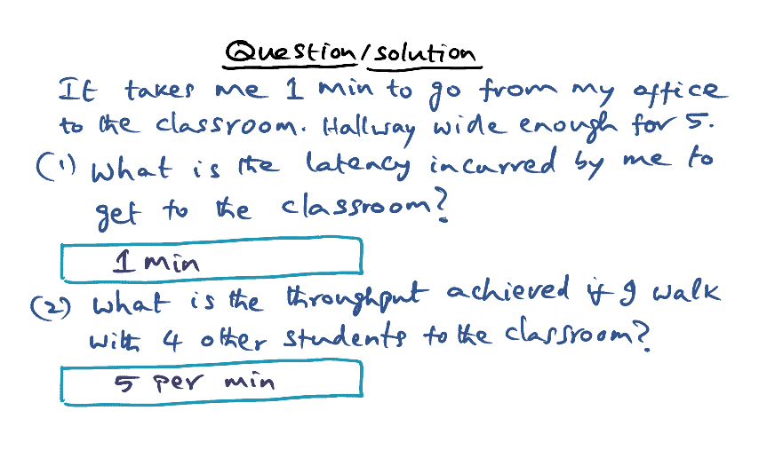

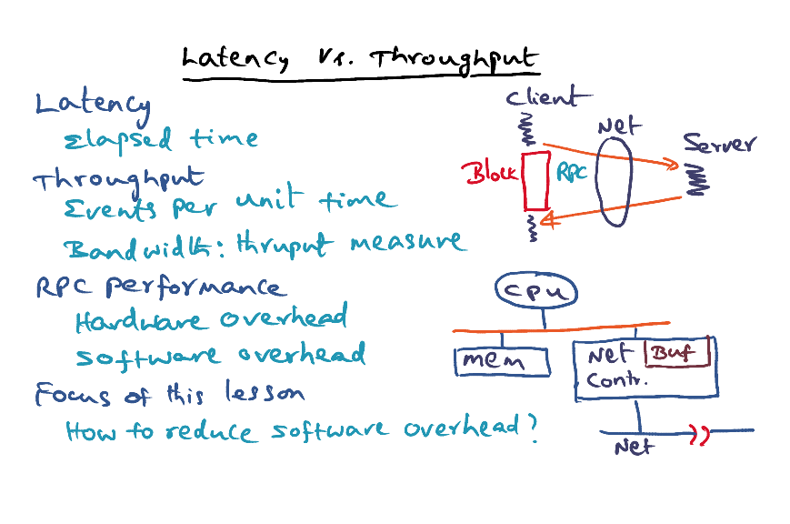

- Latency = time taken / elapsed time for an event
- Throughput = # of Events executed per unit time

<u>RPC Performance:</u> 

Overall latency = Hardware overhead + Software overhead

- Hardware performance: depends on how the hardware is interfaced
  - Copy bits from Memory to Buffer in Network controller using Direct Memory Access (DMA)
  - OR CPU make programmed I/O to move the bits into the the network buffer
- Software overhead: caused by the OS

### Components of Remote Procedure Call (RPC) Latency

1. **Client call**: Client setup <u>arguments</u> for the call, client makes a call into the kernel. Kernel validates the call, <u>marshall</u> the arguments into a network packet, then sets up the <u>controller</u> to do the network transmission.  
2. **Controller latency**: Controller finds the data in memory and DMA the message into buffer.
3. **Time on wire**: Depends on distance between client and server, and the bandwidth. Might need to go through intermediate routers. 
4. **Interrupt handling**: Message arrives as a form of interrupt to the OS. Move bits into controller buffer and then into memory of the node. 
5. **Server setup to execute call**: <u>Locate</u> the server procedure, <u>dispatch</u> the server procedure, <u>unmarshalls</u> the network packets as actual arguments for the server procedures, and then the server can <u>execute</u> the server procedure
6. **Server execution + reply** 
7. **Client setup to receive results & restart**: (2, 3 & 4 repeats) Make network packets, sent to controller, ....

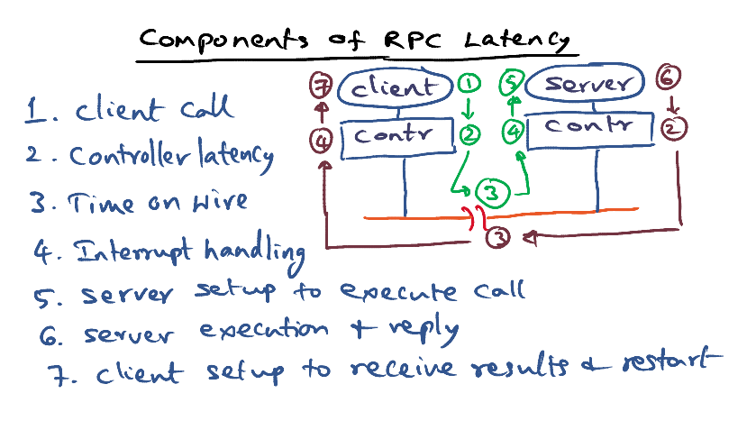

### Sources of Overhead in RPC

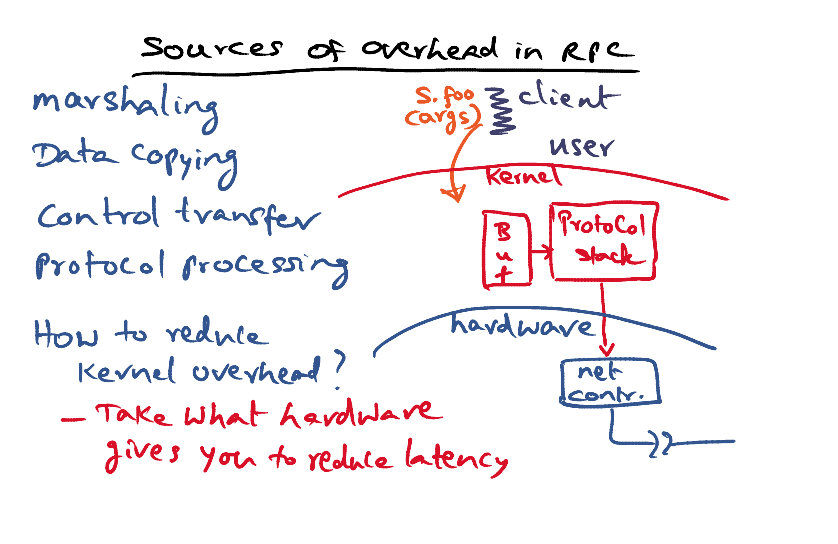

#### 1. Marshalling and Data copying

Data copying is the major overhead in RPC. 

Three copies involved: 

- **Client stub** copy argument from the stack to create a RPC message
- Kernel copies the RPC message into the **Kernel buffer**
- **DMA to controller**, copy data from kernel buffer to internal buffer in network controller

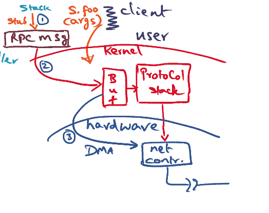

<u>Can we reduce the copies?</u> 

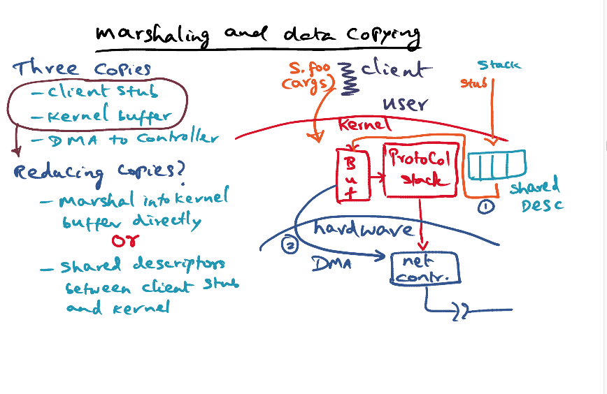

- The third copy (from kernel buffer to network controller) is a hardware action that cannot be avoided. 

- Can we eliminate the copy in client stub? 

  => **Marshall directly into kernel buffer**

  - At bind time (instantiation), the client stub is installed in the kernel
  - The problem is that we have to ensure the stub is trusted and we can put the code in the kernel

  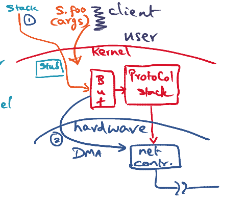

- An alternative is a **shared descriptor between the client stub and the kernel**

  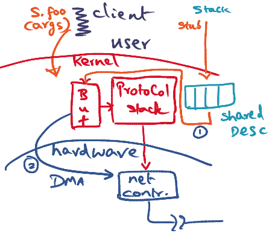

#### 2. Control Transfer

Multiple context switches have to happen to execute a RPC call.

- C - The process that initiated the request in the Client
- C1/2 - Some other process in Client that got context switched to to do some useful work while waiting
- S - The process on the Server that will be processing the incoming request
- S1/2 - Some other process on the server that was doing something else when the request arrived

So the flow is

1. C sent out request, context switched to some other C1
2. S1 was doing something, context switched to S to process incoming request
3. Once done, S sends out result and context switched to some S2 to do other work
4. Back at the client, some process C2 is executing and context switched back to the main C process to receive the results.

- Potentally 4 context switches: 

  - Client: C -> C1 **(Non critical)**
    - Once client makes the call, since it's blocking, kernel can context switch to another proces to make the client busy

  - Server:
    - When server executing some process S1, has to switch to S to receives the RPC call **(Critical)**
    - After send out replies, it has to switch to S -> S2 **(Non-critical)**
      - This can be overlapped with communication

  - Client received: C2 -> C **(Critical)**
    - Switch back to original client to make the result available to client

  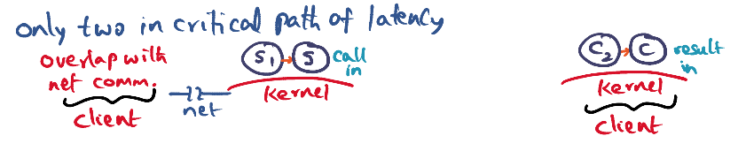

- How many are in the critical paths of RPC? 

  - 2, the call in and result in
    - Call in is required so that the server will be running, and it will be able to receive the RPC request
    - Same for result in, the client has to be running to receive the results 

- Can we reduce the context switch to 1? 

  - Yes. 
  - If the time taken for the RPC procedure is small, the kernel on client side can **spin** instead of context switch on the client side
  - Downside for spinning on client side: wasted resources
  - Can spin for a short amount of time, if results doesn't come back in some time, then context switch on client side

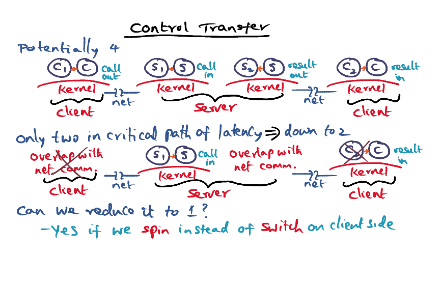

#### 3. Protocol Processing

- Performance vs Reliability usually doesn't come together. 
- Assuming that LAN is reliable, we can work on reducing latency and not worry so much about reliability. 
  - When sending a message in WAN (messages loss in router during queue etc), mesage can get lost. But in LAN, possibility of message loss is not very high. We don't need **low level ACKs**. The semantic of RPC says that the results itself can serve as the ACK. If the results are not received, the caller can resend the arguments.  
  - Message can get corrupted during transmission. Network might get corrupted in WAN, so usually software checksum is required. But In LAN, things are reliable. **Hardware checksum** is sufficient for packet integrity. 
  - Messages might get lost in transmission, usually the packets are **buffered** so that they can get retransmitted if lost. **We don't need client-side buffering**. This can be done with the RPC semantics. The client is blocked, we don't have to buffer the client side, instead we can reconstruct if package is lost. 
  - **Server side buffering is required** so that we don't need to recompute the results if messages is lost. However, the server side buffering can be **overlapped** with the results transmission. 

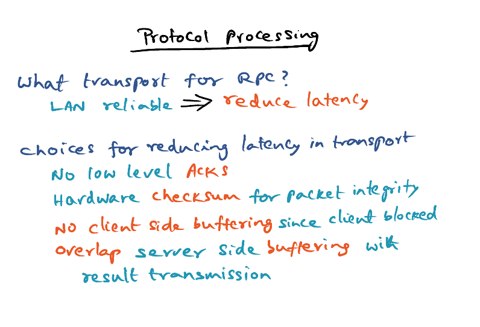

