# L05d: Active Networks

=> End to end QoS via Active Networks 

Reference: [David Wetherall, " Active Networks: Vision and Reality: Lessons from a Capsule-based System ", 17th ACM Symposium on Operating System Principles, OS Review, Volume 33, Number 5, Dec. 1999.](https://gatech.instructure.com/courses/297032/files/36092859/download)

### Routing on the Internet

- Router does not inspect the packets
- Router check the destination, determines the next hop based on the routing table and forward the network packets. 
- Making the routing active == Next hop dynamic
  - Customizing routing
  - How do we ensure the code will not break the network?

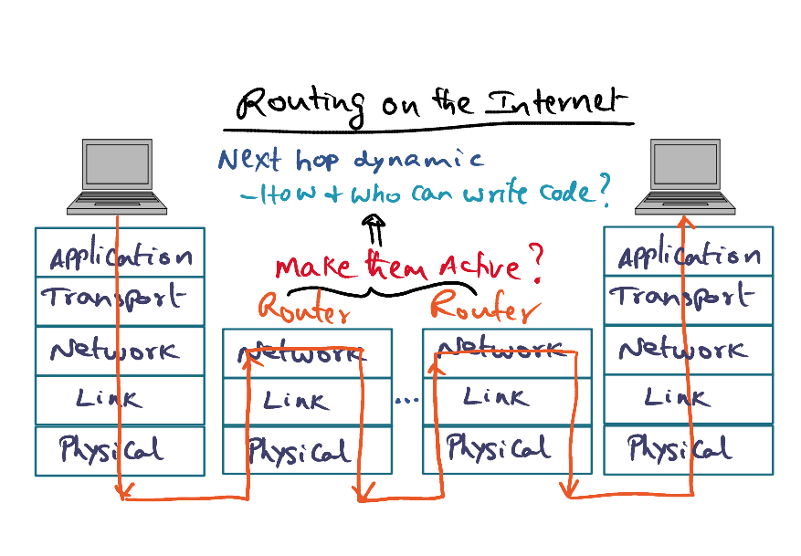

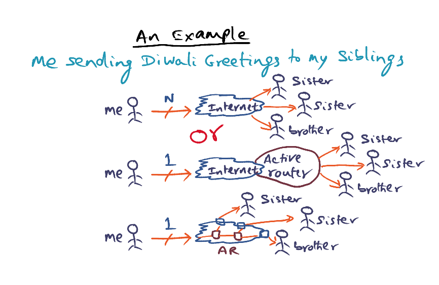

Option 1: Send individual messages to N siblings

Option 2: Send 1 message, finally at close to the destination, the router at the other end demultiplex and send to N siblings

Option 3: Send 1 message, the router demultiplex the message throughout the Internet

<u>How to implement the vision?</u> 

- The OS should provide **QoS APIs** to the applications, (e.g. the network flow has the real-time constraints because of video data), which can synthesize codes that takes the QoS constraints and put them into executable code that can be passed around as part of the package
- The App passes QoS + Payload, the OS generates the code along with the payload, and pass the destination with a IP header
- If the internet is able to handle it, it will be able to make intelligent routing decisions along the network.

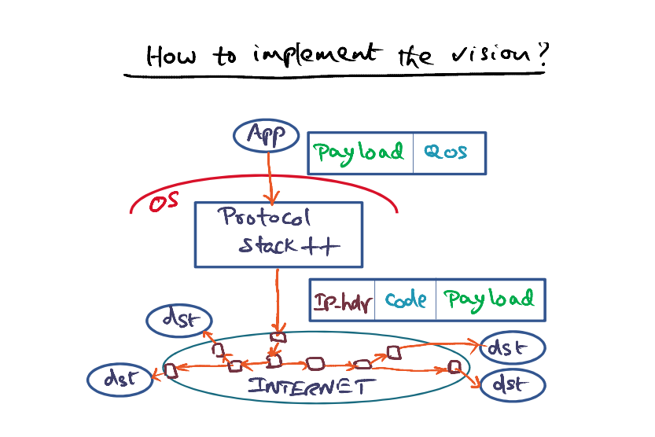

<u>Challenges:</u> 

- Difficult to change the Protocol stack (TCP/IP)

- Network router is not open, we cannot expect that all the network routers are able to execute the code and make intelligent decisions

### ANTS Toolkit (Active Nodes Transfer System)

- Since modifying protocol stack is non trivial, ANTS is an application level package. This toolkit is available for APP level programmer. ANTS toolkit provides a capsule (ANTS Header + Payload)
- Normal Protocol stack picks on the IP Header + Payload (ANTS header + actual payload)
- This capsule will traverse through the network
  - If the router is a normal router, it will simply use the IP header
  - If the node is an active header, it will do the intelligent routing decision. 
- We keep active nodes only at the edge of the network. The rest of the core IP network is unchanged. 

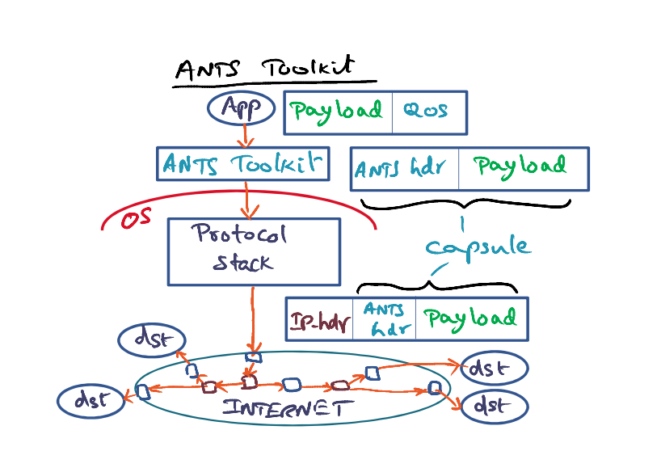

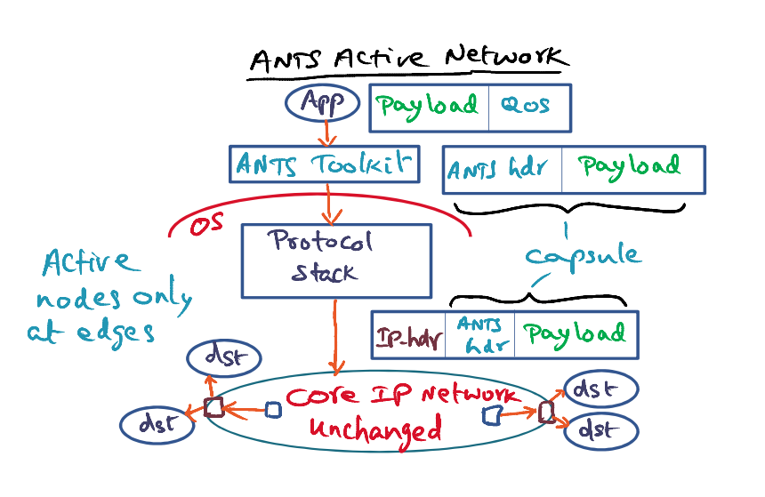

### ANTS Capsule and API

<u>ANTS Capsule</u>

- Normal IP header
- ANTS header
  - Version
  - Type - MD5 hash of code
  - Prev - Identity of the upstream node that successfully process the capsule
  - Hdr
- Payload

<u>APIs</u> (very minimal set of APIs)

- Forwarding packets
- Soft store = a place where we can store whatever that is important for customising the network (e.g. code, computed hints for state of capsule)
- Querying the node for state of network

<u>Routers are in the public internet. Executing the code in network needs to be:</u> 

- Easy to program
- Easy to debug, maintain and understand
- Processing should be very quick

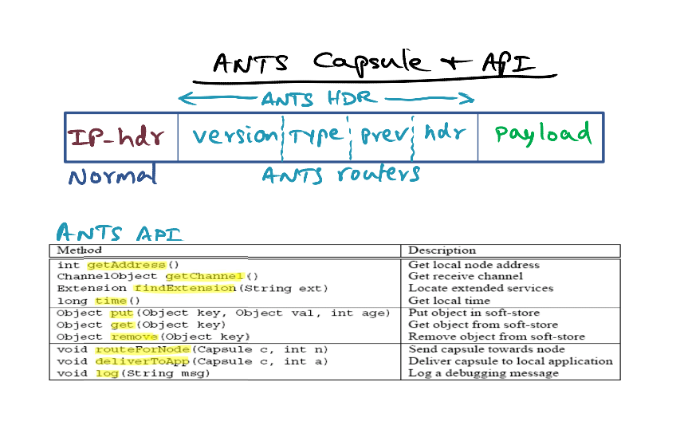

### Capsule Implementation

- Capsule containes **type** identifier. It is passed by reference. 
  - MD5 hash - cryptography storing code
- If capsule has been processed before, it will use the code from the soft store. 
- If not, it will send a request to the **prev** node. 
- Exploit locality for code that are stored in the soft store since we are likely to see the same types of capsule again in future. 
- Code proofing is done by comparing the code with the MD5 hash
- If go back to previous node and the previous node is not found also, it will drop the capsule. Higher level ACKs will fail, and the source will retransmit. 

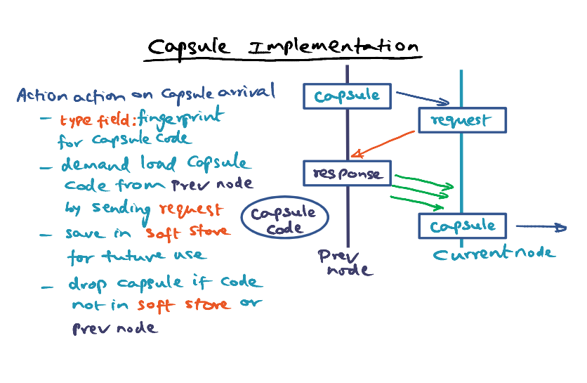

### Potential Apps

Active network is useful when we desire certain ways to virtualise the behaviours of network. 

- Things that are related to <u>network functionality</u>. (Provide network layer functionality, not app layer functionality)
- Overlay our desire on network topology on top of the physical topology.
- Must be expressible, compact and fast, and not relying on all the nodes being active. 

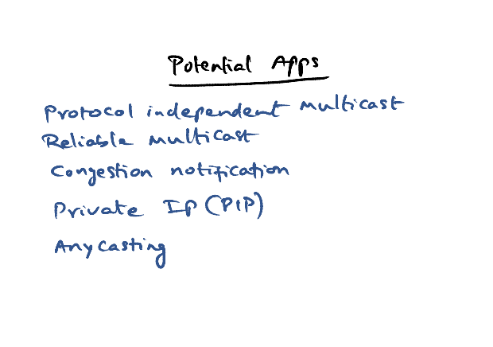

### Pros and Cons of Active Networks 

Cons: 

- **Protection threats**
  - ANTS runtime safety => use Java sandbox for the code
  - Code spoofing => **Robust fingerprint**, type field with cryptographically strong fingerprint, always match the fingerprint with its previous node
  - Soft state integrity => The soft store is limited in size, we don't want any particular network flow to consume all of it. => **restricted API** 
- **Resource Management threats**
  - e.g. Proliferate packets in internet
  - At each node => restricted API
  - Flooding network with capsule processing

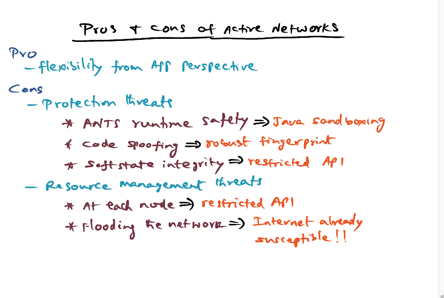

### Roadblocks

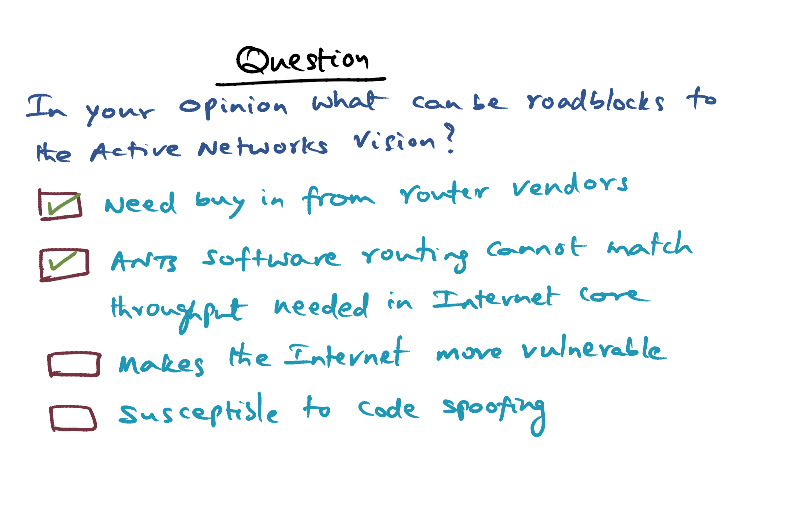

- Convincing the router vendors to open up the network
- Traffic on internet is huge. Routers have to be efficient, i.e. just table lookup. 
  - Even at edge networks, it's at gigabit speeds
  - The core of the network has to be much faster. 
  - Software routing cannot match the throughput required for Internet. 

### Feasibility of Active Networks

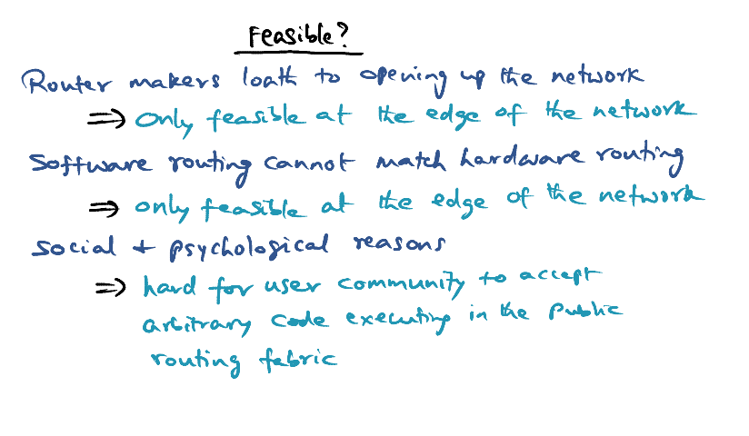

### Conclusion

Active network is way ahead of its time. Active network focus more on safety rather than performance. Cloud computing promotes utility computing, which raises a need for sharing network on the same physical hardware. This calls for the need for Software defined networking (SDN).

