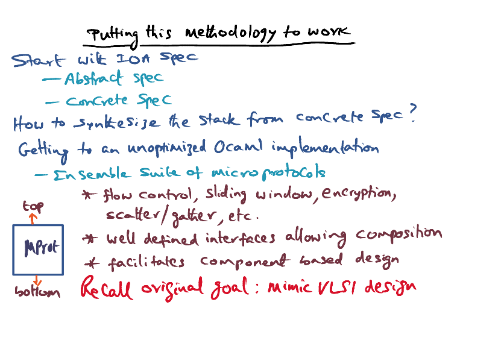

# L05e: Systems from Components

Reference: [Liu, Kreitz, van Renesse, Hickey, Hayden, Birman, Constable, "Building Reliable High Performance Communication Systems from Components ", 17th ACM Symposium on Operating System Principles, OS Review, Volume 33, Number 5, Dec. 1999.](https://gatech.instructure.com/courses/297032/files/36092771/download)

### Introduction

Component based approach to build large complex hardware. 

- Reuse software components

- Component based design is easier to test and optimize at individual component level. 

- Component based design can be used in each subsystem
- Challenges:
  - Inefficiencies due to additional component level function calls
  - Loss of locality whern crossing components
  - Unnecessary redundancy (copying)
- The idea is to synthesize network protocol stack

### The Big Picture

- Specify
  - IO Automator
  - C-like syntax to specify requirements
- Code
  - Ocaml, Object oriented categorical abstract machine language
    - nice complement to IoA
    - **object** oriented, no side effects for things you do in the program
    - as **efficient** as C 
- Optimise
  - Nuprl, theoretical framework

### From Spec to Implementation

<u>**Abstract** Behavioural Spec</u>

- use IoA

  - High level logical specifications of the components

  - The **properties** the component has to adhere to 

  - **Proof facilitated by IoA**

<u>**Concrete** Behavioral Spec</u>

Refinement from Abstract Behavioral Spec

<u>Implementation</u>

OCaml

- Scheduling of operatings of concrete behavioral spec
- Efficient, compact, object-oriented
- Executable code
- Compact code
- Automatic memory allocation, garbage collection, marshalling and unmarshalling arguments when passing from components.
- Programmability similar to C
- Definitions of primitives of OCaml 
- this is the unoptimized version of the implementation

=> There is no easy way to show the OCaml implementation is same as IoA specification

### From Implmentation to Optimisation

<u>Nuprl Theorem Prover Framework</u>

- First, convert rom Unoptimized ocaml code to unoptimized nuprl code. 
- Optimize it and use **optimisation theorems** to prove the optimized NuPrl code is same as the unoptimized Nuprl Code
- Lastly, convert optimized nuprl code back to optimized ocaml code.

### Putting the Methology to Work

- Start from IoA Spec

  - Abstract Spec => Prove that it meets the properties we need through IoA
  - Concrete Spec

- How do we synthesize the stack from Concrete Spec? 

  - Ensemble suite of microprotocols
    - Use components to build giant protocol like TCP/IP, that requires build of multiple features, e.g. flow control, sliding window, encryption, scatter, gather, etc
    - about 60 microprotocols 
    - Well-defined interfaces that allow composisiton
      - each microprotocols has interface to layer on top and below it

  

### How to Optimize the Protocol Stack?

Can a stack be synthesized by an ensemble of microprotocols?

Given 60 microprotocols in the ensemble suite, there's too many combinations for a brute-force approach. We use a heuristic approach based on developers' knowlege, leading us to a working protocol stack but not optimized. 

- Layering leads to inefficiencies
  - In VLSI component-based-design, there's no inefficiencies. They just fits together. 
  - In software design, there are interfaces specifications & well-defined component boundary, which needs extra work like copying.
- Optimisations possible
  - We use **explicit** instead of Implicit garbage collection to make use of memory efficiently
  - Avoid marshalling/unmarshalling when going across layers to reduce overheads (collapsing the layers)
  - Communication and computation
    - **Buffering** in parallel with **transmission** (overlap)
  - **Header compression** (common fields across layers)
  - **Locality** enhancement for common code sequences => ensure that the working set fits into the cache

### How do we automate the optimizations instead of doing them manually? => Use NuPrl

- **Static Optimization**
  - needs a <u>Nuprl expert and OCaml expert</u>
  - In a <u>semi-automated</u> method, they are going through layer by layer and come up with more optimized implementations (not optimizations between layers)
    - The optimization can be done with the theorem proving framework
    - Whether the optimisations is appropriate have to be <u>verified</u> with manual intervention
  - e.g. Function inlining, direct equality substitutions
- **Dynamic Optimization**
  - Multiple layers in protocol stack increase latency to overall processing of any message
  - Dynamic optimization tries to collapse multiple layers
  - <u>Completely automatic</u> by the theorem proving framework
  - Identify the common things that happen across layers
  - **CCP (common case predicate)**
    - Recognizating the state of the protocol at any point of time, and how the protocol has to react to the event
    - If CCP satisfied (conditional statements of microprotocols), we can execute the bypass code and eliminate the multiple layers of protocols
    - This can be done at every layer, and collapse many layers
- Final Step: <u>Convert back to OCaml</u> => Optimized version of the original OCaml code
- Nuprl is doing <u>optimisation</u> not <u>verification</u> (Not verifying whether OCaml code is adhering to the behavioural specification). 

