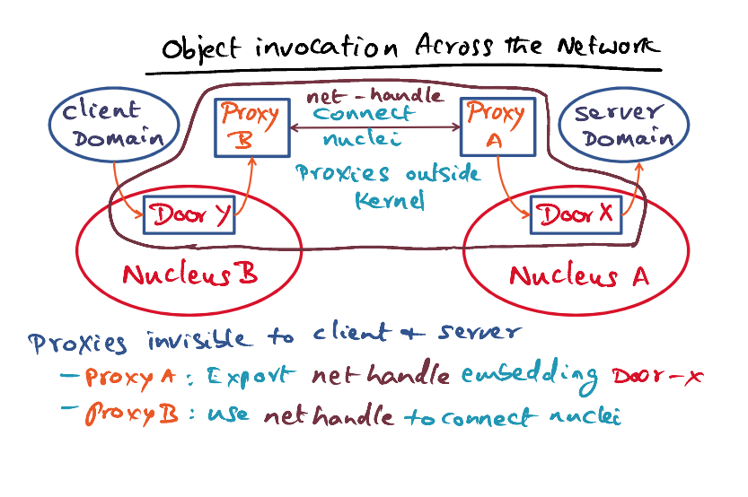
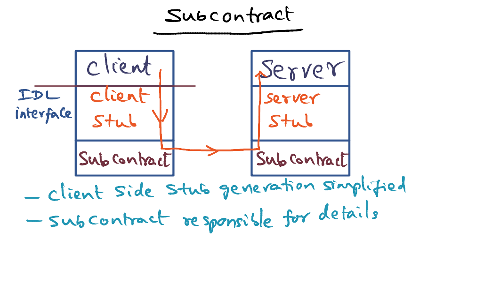
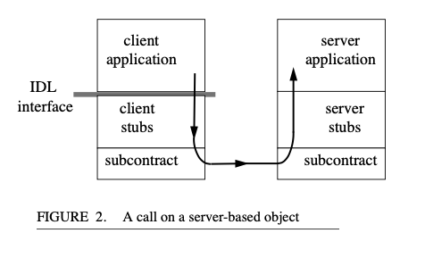

# L06a: Spring Operating System

- **Distributed object technology**

Reference: [Mitchell, J. G., et al., " An Overview of the Spring System ", Proceedings of Compcon, Feb. 1994.](https://gatech.instructure.com/courses/297032/files/36092779/download)

### Overview

- Spring System 
- Java RMI
- EJB

### How to Innovate OS?

- At Spring, "Be different, but innovate where it makes sense"
- Ensure that third party vendors can use the new APIs in the OS to build the products, but doesn't break anything existing
- External interfaces are the same, but internal implementation can be innovated
- Ensure the innovation allows extensibility, flexibility and so on
- Use object orientation

### Object-based vs Procedural Design

<u>Procedural Design</u>

- monolithic 
- subsystem makes procedural code to another subsystem
- shared state via global variables

<u>Objects</u>

- Strong interfaces 
- Complete isolation of states of objects from everything else
- State is specific to the object, invisible to outside except through the invocation through the methods

### Spring Approach 

-  Strong interfaces for each subsystem
  - the "How" part can be changed anytime
- Open, flexible and extensible
  - IDL - Interface Definition Language
    - Third party vendors can use the IDL to integrate with the Spring subsystem
  - Extensibility leads to microkernel based approach
    - Nucleus -> provides abstraction of **threads** and **IPC**
    - VM Manager -> provides **memory** management 
- Spring's answer for building a **Network Operating System** 

## Nucleus Microkernel of Spring

- Nucleus manages only **threads and IPC**
- **Domain** (like UNIX) - threads can execute in domains
- **Door** - entry points to target domain
- Every domain has a door table (like a file descriptor in UNIX) to keep the door handle. If you have a door handle, you can make object invocations on the target domain. 
  - A particular domain can have a door table that has different handlers to different target domain. 
  - Door table is unique to each domain. 
  - Door = software capabilities to the target domain
    - Can be passed from domain to domain
- How to make an object invocation? 
  - Nucleus is involved in every door calls. We need the permission of nucleus.
  - When making invocation using the descriptor, the nucleus check the domain has privilege to do the invocation, and then allocates a server thread in the target domain and executes the invocation as a procedure call. The client thread is deactivated.
  - When the procedure call is completed, on return, the server thread is deactivated, and the client thread is reactivated. 

### Object Invocation Across the Network

- Use **network proxies**

  - Proxies can **employ different protocols** depends whether it's LAN/WAN

- Proxies are invisible to client and server

  - Client and server are not aware whether they are in the same machine or different machines

- Client-server connection

  - instatiates a Proxy A on the server node, and establish a Door X for communication between proxy A and server domain through the nucleus 
  - Proxy A **exports** a **network handle** embedding Door-X to its peer Proxy B on the client domain (outside nucleus A)
  - Proxy B has a door Y established locally on nucleus B so that client domain can communicate with it
  - Proxy B use network handler exported by Proxy A to establish the connection with Proxy A

  

### Secure Object Invocation

- Different privileges for different users
- Security model via a front object (completely outside of the Spring semantics), not through the door object
- Client domain go through the door to access the front object, and the front object checks the **ACL** (access control list) for the privileges before allowing the invocation to the underlying object
- Example: 
  - User has full access to foo object
  - User gives one time privilege to foo object to the printer. The printer can access the foo object  for 1 time, but when present again, it will be rejected by the front object.
- The use of software capabilities in Spring makes it easy for application programs to pass objects to servers in a way that allows the server to actually use the given object.

## Abstractions

## Virtual Memory Management in Spring 

- Per machine Virtual Memory Manager
- Abstractions: 
  - **Regions** : VMM breaks the linear address spaces into regions. Regions are a set of pages. 
  - **Memory objects** - Regions mapped to different memory objects. Different regions can map to the same memory objects. 
    - An abstraction for things living on the backing store, i.e. disk, swap, specific files that are memory mapped in order to access from the process address space. 

### Memory Object Specific Paging

- **Pager object** 
  - External pagers 
  - Establish connections between virtual memory (Memory object) & physical memory (cache objects)
  - Create a **cache object** representation in the DRAM
- Dynamically created
  - Memory object shared by 2 different address spaces
- Coherence is up to pager object
  - If coherence is needed, the pager obj should be responsible to managing the regions that they are mapping to
- In summary:
  - The address space managers are responsible to manage the linear address spaces of a process
  -  They manage by carving the linear address spaces into regions and associate the regions to different memory objects (e.g. swap space/file objects)
  - Mapping memory objects to cache representation in DRAM is the responsibility of pager objects.
  - We can have as many number of external pagers that manages the mapping. 
  - For a single linear address space, we can have multiple pager objects that manages different regions in a single address space. 

## Spring System Summary

Contrast with Tornado: 

- Tornado uses cluster objects as optimisation mechanism, Spring uses objects as system structuring mechanism in constructing a network operating system

  

## Dynamic Client Server Relationship

- Spring as a network OS
- Client-server interaction should be freed from the location of the machines
- Server **replicated** to increase availability. Client requests routed to different servers dynamically depending on load & physical proximity.
- Server **cached** (e.g. web server). Client requests can go to the cached copies instead of root server. 

### Subcontracts

- Subcontract hides runtime behaviour of objects from the actual interface. 
- *subcontract,* allows control over how object invocation is implemented, over how object refer- ences are transmitted between address spaces, how object references are released, and similar object runtime operations
- All the details of how the client's IDL interface is satisfied is in the subcontract details. 
- Subcontracts can be dynamically discovered, loads, and installed at runtime. Client stub doesn't need to change anything. 
- We can add functions to existing services using subcontract mechanisms. 

### Subcontract Interface for Stubs

- Client stub marshalls => call the subcontracts, subcontracts do the required to marshall the arguments 
- Client make invocation. Subcontract knows where the invocation needs to go. 
- Client and server stubs don't have to do anything differently whether the client and server are on the same machine or not. Subcontracts hide all the implementation details. 

## Summary of Spring Innovations

- Uses object technology as a **structuring** mechanism in building a network OS
- Ensure it provide **strong interfaces**, it's **open** and **flexible**, it's **extensible** (not a monolithic, it's a microkernel). All services are provided through the object mechanism living on top of the kernel. 
- Client and server don't have to know whether they are collocated on same node, or exist on different nodes on the LAN. The object invocations across network are handled through the network proxies. The subcontracts allow client and server to dynamically change their relationship. Client can dynamically binds to new instances of server that has been created. 

- Innovation under the covers. 
  - Subcontracts => Java RMI

