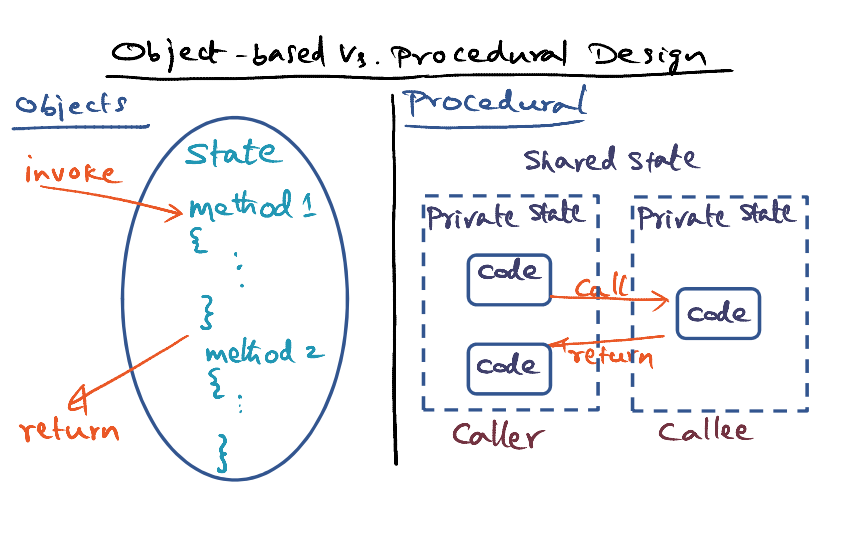

# L06a: Spring Operating System

- **Distributed object technology**

Reference: [Mitchell, J. G., et al., " An Overview of the Spring System ", Proceedings of Compcon, Feb. 1994.](https://gatech.instructure.com/courses/297032/files/36092779/download)

### Overview

- Spring System 
- Java RMI
- EJB

### How to Innovate OS?

- At Spring, "Be different, but innovate where it makes sense"
- Ensure that third party vendors can use the new APIs in the OS to build the products, but doesn't break anything existing
- External interfaces are the same, but internal implementation can be innovated
- Ensure the innovation allows extensibility, flexibility and so on
- Use object orientation

### Object-based vs Procedural Design

<u>Procedural Design</u>

- monolithic 
- subsystem makes procedural code to another subsystem
- shared state via global variables

<u>Objects</u>

- Strong interfaces 
- Complete isolation of states of objects from everything else
- State is specific to the object, invisible to outside except through the invocation through the methods

### Spring Approach 

- Strong interfaces for each subsystem
  - the "How" part can be changed anytime
- Open, flexible and extensible
  - IDL - Interface Definition Language
    - Third party vendors can use the IDL to integrate with the Spring subsystem
  - Extensibility leads to microkernel based approach
    - Nucleus -> provides abstraction of **threads** and **IPC**
    - VM Manager -> provides **memory** management 
- Spring's answer for building a **Network Operating System** 

### Nucleus Microkernel of Spring

