# Java RMI

=> Distributed Object Model for the Java System

[Wollrath, A., Riggs, R., and Waldo, J., "A Distributed Object Model for the Java System", Usenix Conference on Object Oriented Technologies and Systems, May 1996.](https://gatech.instructure.com/courses/297032/files/36092897/download)

### Java History 

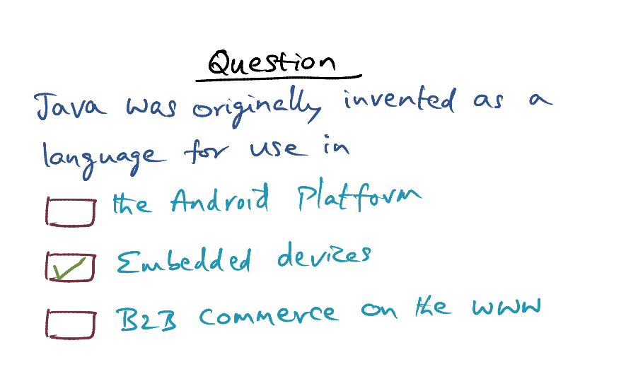

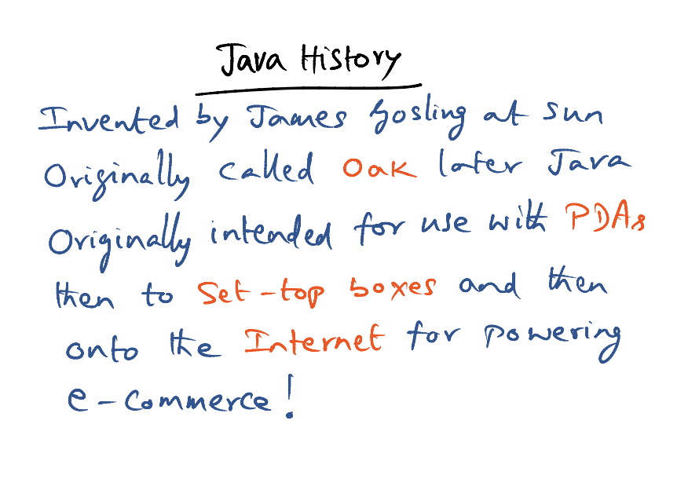

## Java Distributed Object Model

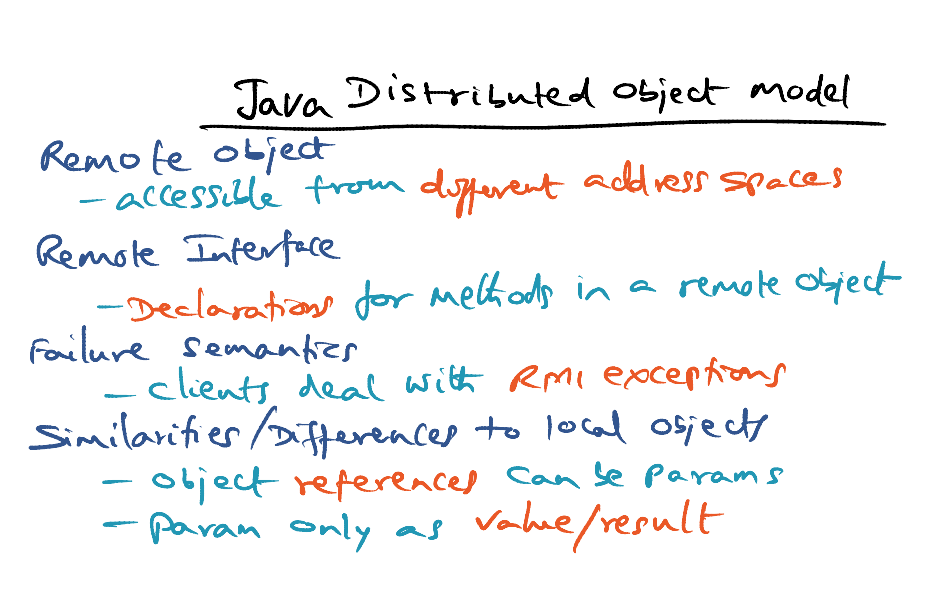

Java RMI 

- Remote object - Objects are accessible from different address spaces
- Remote Interface - Declarations
- Failure Semantics - Client have to deal with RMI Exceptions

The **similarities** between the distributed object model and the local Java object model are:

- **a reference to a remote object** can be passed as an argument/parameters or returned as a result in any method invocation (local or remote);
- a remote object can be cast to any of the set of remote interfaces supported by the implementation using the built-in Java syntax for casting;
- the built-in Java instanceof operator can be used to test the remote interfaces supported by a remote object.

There are several basic **differences** between the distributed object model and the Java object model:

- clients of remote objects interact with remote interfaces, never with the implementation classes of those interfaces;

- clients must handle an additional exception for each remote method invocation;

- parameter passing semantics are slightly different in calls to remote objects;

- semantics of Object methods are defined to make sense for remote objects.

- In local object of Java, when a reference is passed as a parameter, the method can reach into the object and make changes to the referenced object. In distributed object model, **a copy of object** is sent to the invoke method. The reference is converted into value/result. If client makes changes to the reference, the server will not see it. 

  

<u>Example: Bank Account Server</u>

Server APIs - Deposit, Withdraw, Balance

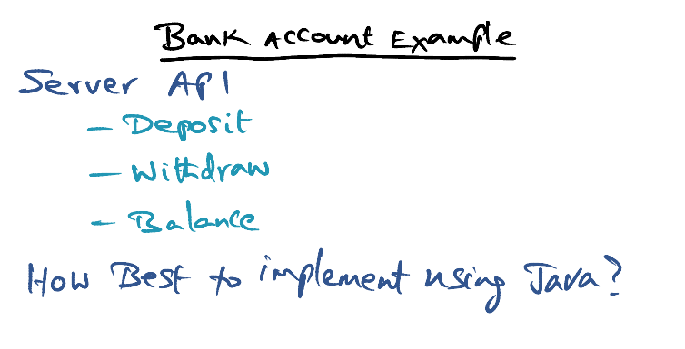

###### **<u>Option 1: Reuse of Local Implementation</u>**

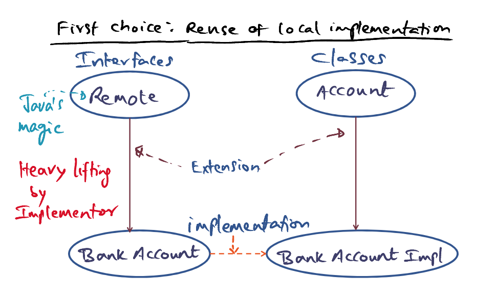

- Clients on the network has access to the Bank Account Interface

- When bank account implementation is instantiation, the actual location is not visible to the client. The **implementer** does the heavy lifting to publish the interface to any clients on the network. 

  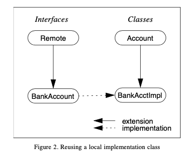

  

###### **<u>Option 2: Reuse of "Remote"</u>**

- Extend remote object and remote server classes (inherit from Java Remote), when instantiate the Bank Account Implemtation, it becomes instantly visible
- Heavy lifting done by Java Runtime

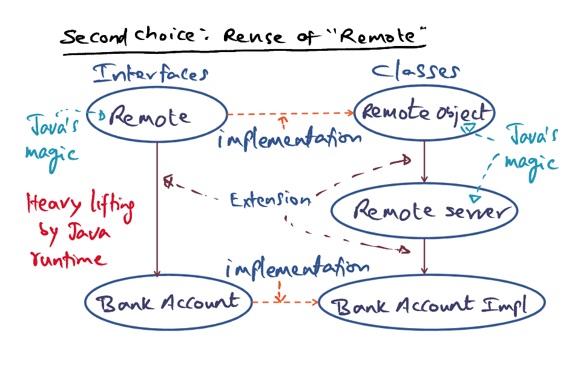

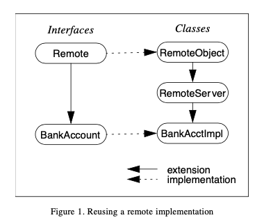

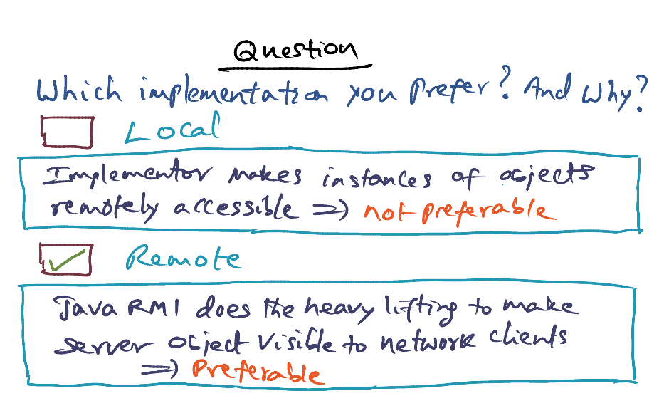

- If using local implementation, the service provider can make certain services visible and certain not. 

## Java RMI at Work

- Server
  - Instantiate object
  - Create url
  - Binding the url to the instance of object that you created 

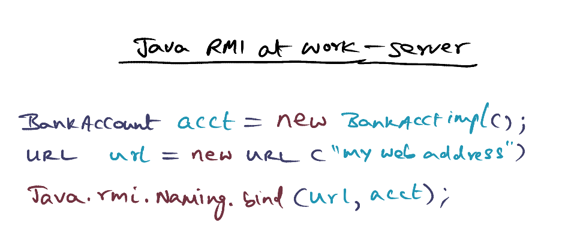

- Client
  - Lookup for the service provider via a published URL
  - Local access point is created on the client side, through the local name `acct`
  - Call the methods like normal procedural calls
  - If any remote exceptions is thrown, the client has to handle it. The client will not know at which point the exception occurs. 

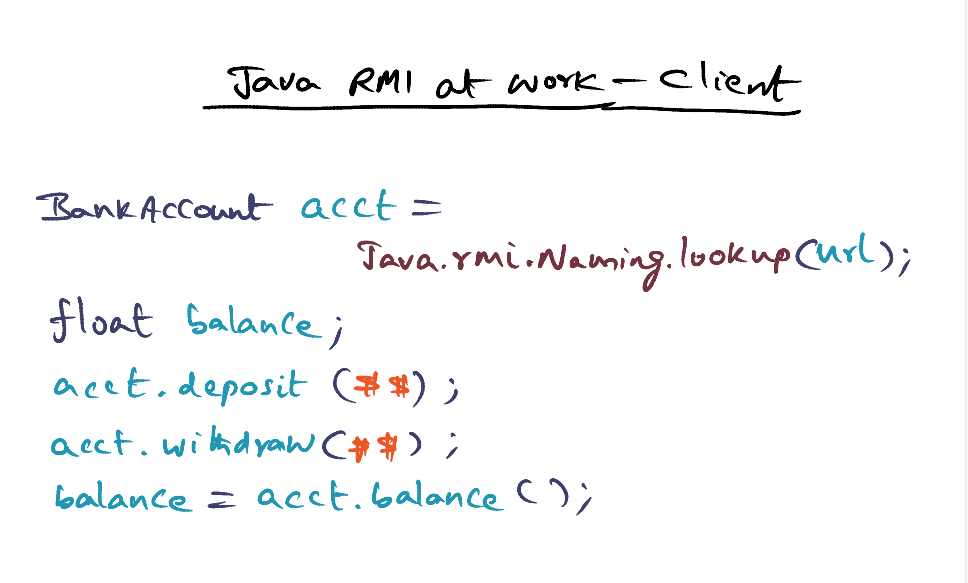

## RMI Implementation - Remote Reference Layer, RRL

- The three layers of the RMI system consist of the following:
  - stub/skeletons — client-side stubs (proxies) and server-side skeletons (dispatchers)
  - remote reference layer — invocation behavior and reference semantics (e.g., unicast, multicast)
  - transport — connection set up and management and remote object tracking
- The client side stub initiate a RMI call through the RRL
  - Marshall arguments
  - Send over network
  - Unmarshall results into data structure that client understands
- On server side
  - Skeletons unmarshall(deserialize java objects) arguments using the RRL
  - Skeleton makes call up to server
  - Skeleton marshalls(serialize java objects) the results and use RRL to send the results to client
- RRL allows for various invocation protocols between client and servers

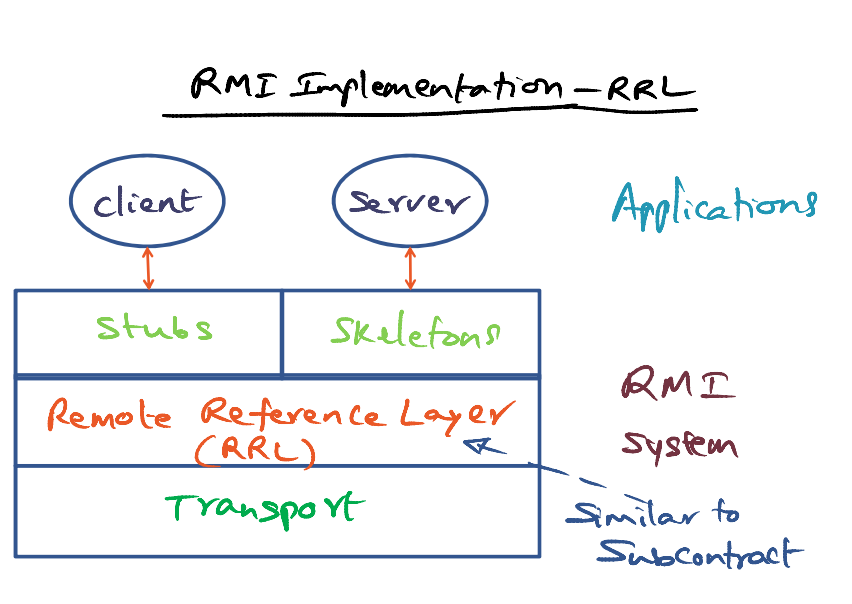

## RMI Implementation - Transport

- Abstractions
  - Endpoint
    - Java Virtual Machine
    - Protection Domain / Sandbox
  - Transport 
  - Channel 
    - Listen for connections, establish a channel for transport
  - Connections
    - I/O on channels
- Connection Management
  - Setup, teardown, listen for connection
    - A given endpoint can use different protocols to different endpoints
    - locating the dispatcher for the target of the remote call and passing the connection to this dispatcher
  - Liveness Monitoring 
  - Choices of transport (UDP/TCP)

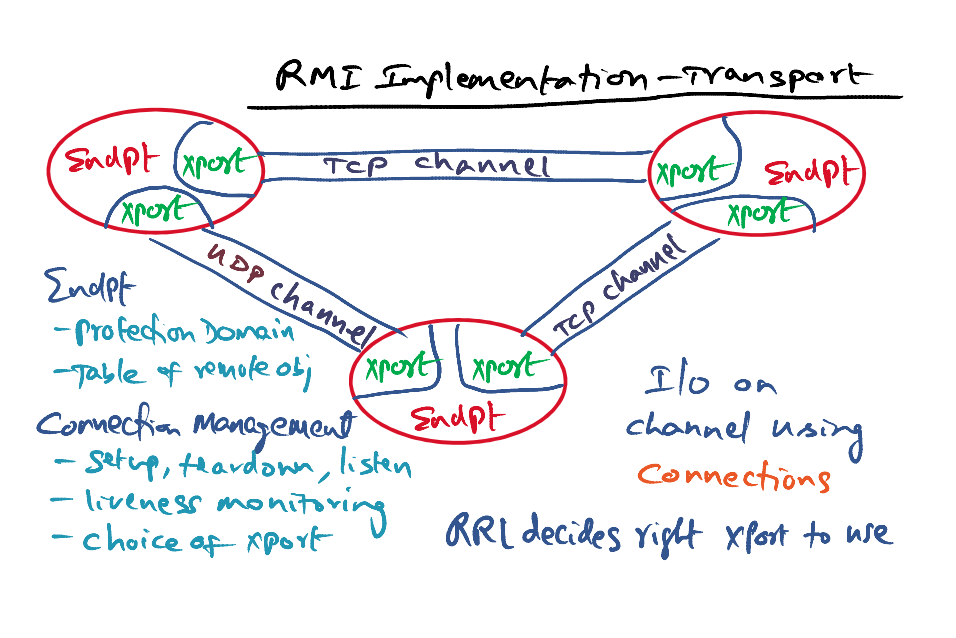

