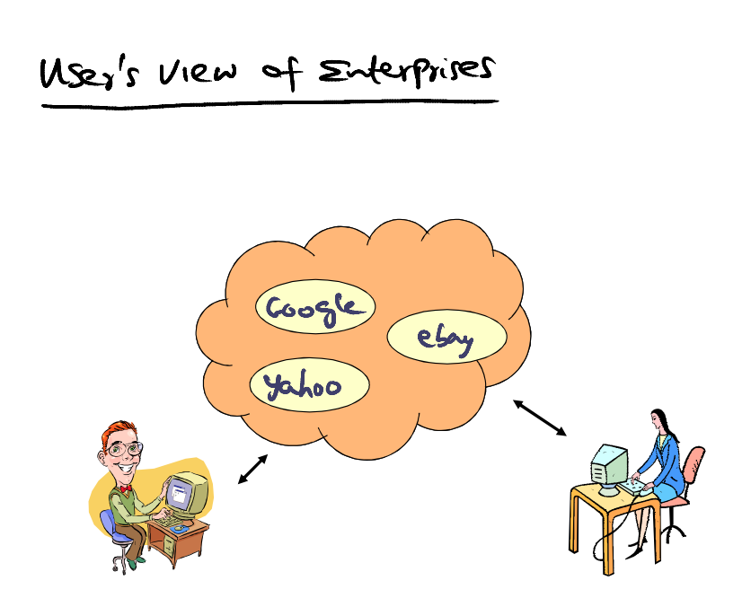
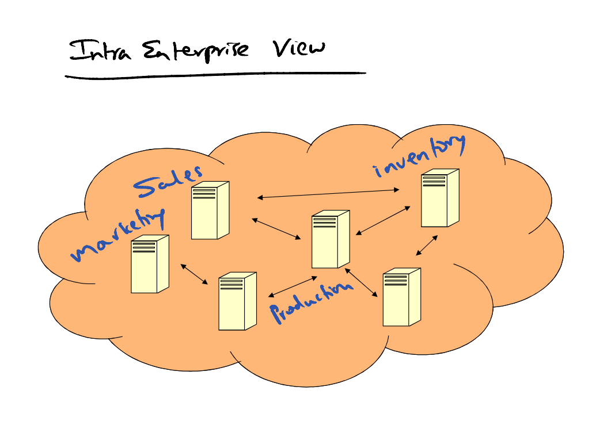
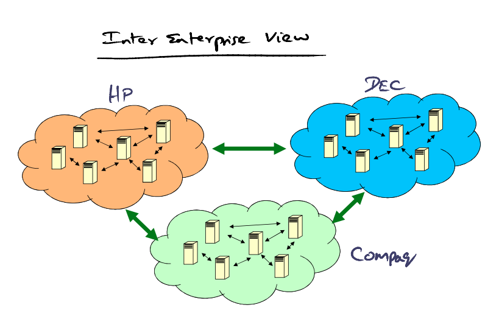
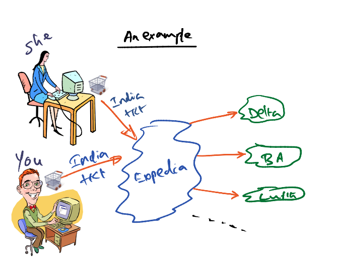
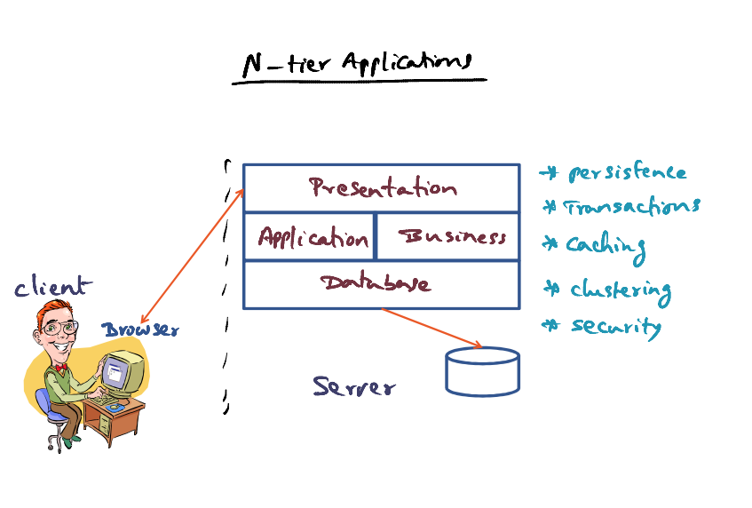
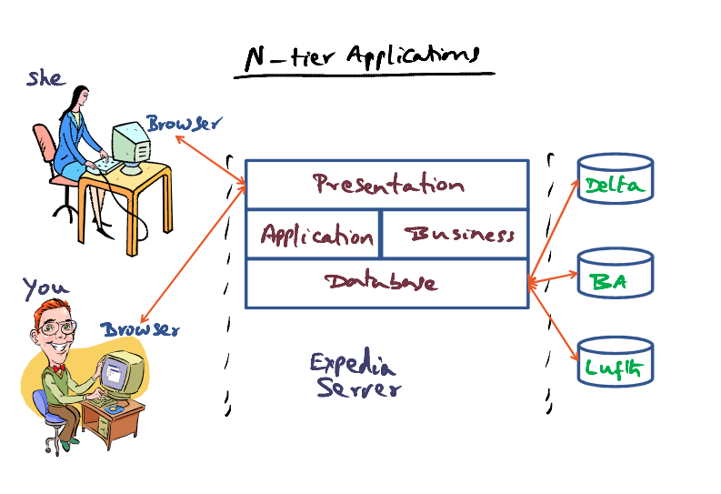
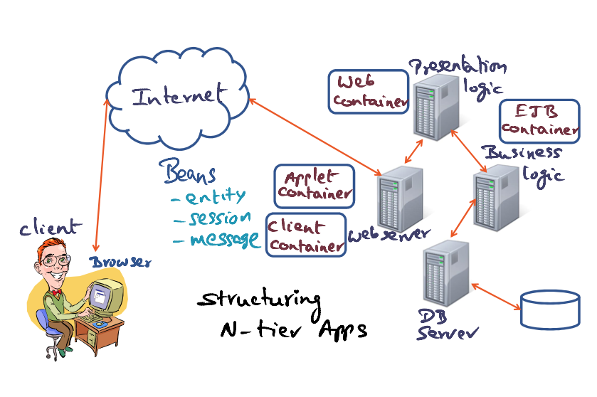
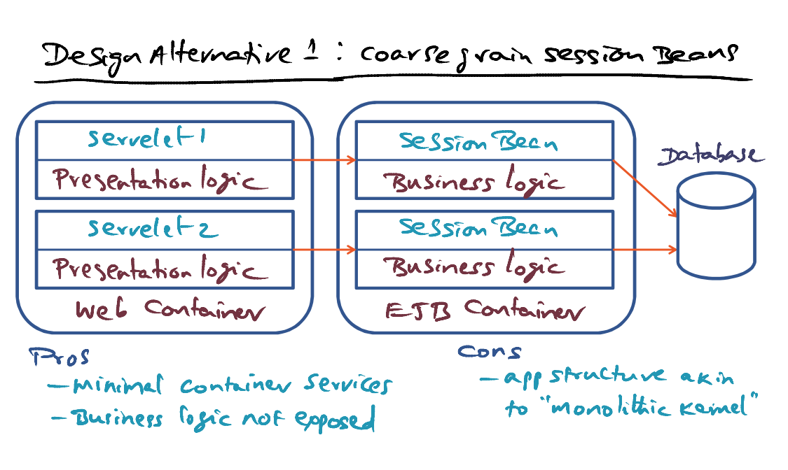
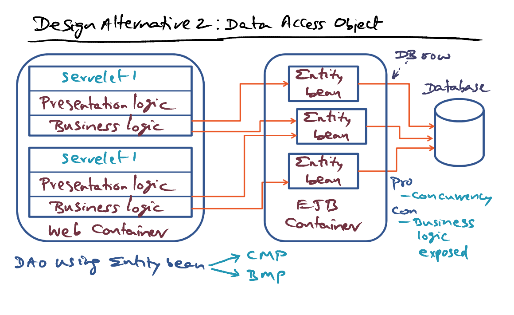
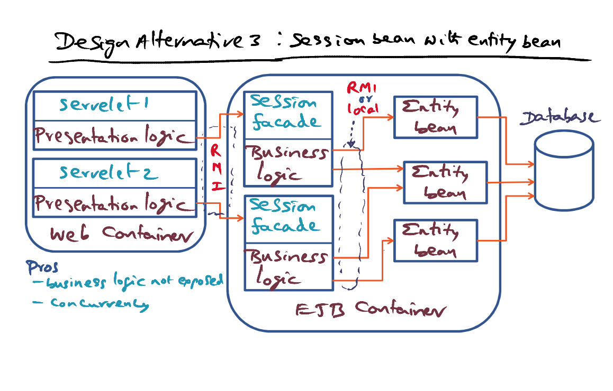

# Enterprise Java Beans (EJB)

[Emmanuel Cecchet, Julie Marguerite, Willy Zwaenepoel, "Performance and Scalability of EJB Applications", Proceedings of the 17th ACM SIGPLAN conference on Objectoriented programming, systems, languages, and applications. Paywall:](https://gatech.instructure.com/courses/297032/files/36092785/download)

- Java Beans = Reusable Java Components (Java objects in bundles) 

### Challenges  

- Supply Chain Model 

  - Contact other entities

  - Enterprises merge

    

### Enterprise Java Beans Example

Expedia contacts different airlines and return with different options. You make a choice, and send your request to Expedia, and Expedia will send your request to the airline. Simultaneous requests can occur, causing conflicts. Enterprises need to work together to handle the conflicts across space and time. There are common features like carts across enterprises. Many features are repeatable even the service provided are different. We don't want to reinvent the wheel everytime. That's why we need object technologies, and to reuse components.  

## N-Tier Applications

- We want to reduce amount of network communications and security risks, increase concurrency, clustering computations, reuse components. 

### Structuring N-Tier Applications

- The J2EE run-time environment includes four different containers: the **application client container**, the **applet container**, the **Web container** and the **Enterprise JavaBeans (EJB) container**. 

  - Client Container

  - Applet Container 

  - Web container (Presentation Logic) - Dynamically creating pages 

  - EJB Container (Business Logic) => Usually is the bottleneck

- Beans = A unit of reuse

  - Entity (a row of database)
    - Persistent objects with Primary keys
    - Bean-managed persistence

  - Session 
    - Associated with a particular client & a particular session
    - **Stateful** session bean (remember the choices) / **Stateless** session bean (email session)

  - Message-driven bean
    - Async
  - Finer level of granularity beans 

- Container 

## Design Alternatives

### 1. Coarsegrain Session Beans

- Structuring the Web container and EJB Container 
- 1 Session Bean associated to each servlet (individual session associated with a particular client) in the presentation logic
  - Session bean contacts database server to pull specific information for business logic related to the client session
- EJB Container provides services to support concurrent sessions
  - Minimal requirement for the EJB container to support this model, and is confined to any conflicts that can arise between concurrent independent session 
    - Pros: **minimal container services**
  - Primarly to coordinate the concurrent requests to DB
  - The session beans benefit from the **connection pooling** and the **transaction management** provided by the EJB server.
  - Business logic is confined in EJB
    - Pros: **Business logic is not exposed beyond corporate network**
  - Cons: the application is monolithic, very limited concurrency for accessing different parts of a database 
    - Structure doesn't allow to exploit concurrency for pulling large amount of data from same sections in database simulatenously

### 2. Data Access Object (DAO)

- The business logic embedded in the servlets directly invokes methods on the entity beans that map the data stored in the database. 
- Exploit parallelism for accessing database
  - I/O & network communication 
- 3 tier architecture in web container
  - Servelet
  - Presentation logic
  - Business logic
- Entity bean is persistent
  - Each bean is a DB row / set of rows in DB
  - Exploit parallelism in database accesses
- Servelets can request for many entity beans to serve the requests
- Concurrent requests can use the same entity bean 
  - Clustering database access
- Entity beans deal with **persistent** state
  - Persistence can be done at level of entity bean => **Bean Managed persistence (BMP)**
  - Container is providing the facility => **Container Managed Persistence (CMP)**
- Pros: **Concurrency for data access** (for same client in parallel, or different clients that access same data)
- Cons: **Expose the business logic** to outside method (not confined to corporate network)

### 3. Session bean with Entity Bean

- Session bean as a facade

- Associate a **session facade** with a client servlet
  - Web container contains only <u>servlet & presentation logic</u>
  - Business logic sits with session facade in the EJB container
    - **Pros: Business logic is not exposed outside of corporate network**
  - **Data access object** implemented with the **Entity Bean** 
  - Session facade worries about the data access needs related to the business logic
  - Session facades farm out parallel data access requests corresponding to the business logic associated with the session to multiple entity beans
    - **Pros: Concurrency**
  - Entity bean may be responsible for individual rows or cluster of rows in database 
- Web container use RMI to communicate with the Business logic
- Choices to structure the session bean with respect to entity bean: 
  - Session facade can use RMI or local interfaces to communicate with the entity bean
  - Use **RMI** allow us to keep the entity bean wherever we want in the local network
  - Using **local interface** means we will **collocate** the entity beans in the same EJB container as business logic and session facade
    - Because it is local, we don't have to incur network communciation in order to fetch data from entity bean
  - Cons: Communication betwen Session facade and entity bean incur additional network access => but can be removed by collocating the entity beans and the session facade in the same EJB Container
- Pros: getting the best of both worlds

