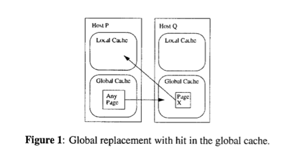

# Global Memory Systems

[Feeley, Morgan, Pighin, Karlin, Levy, Thekkath,, "Implementing Global Memory Management in a Workstation Cluster ", Fifteenth ACM Symposium on Operating System Principles, Dec. 1995.](https://gatech.instructure.com/courses/297032/files/36093029/download)

### Distributed Subsystems Overview

- **GMS (Global Memory System)**
  - How can we use peer memory (idle memory) for paging across LAN? 
- **DSM (Distributed Shared Memory)**
  - Can we make the cluster appear like shared memory machine? 
- **DFS (Distributed File System)**
  - Can we use cluster memory for cooperative caching of files

### Context for Global Memory System (GMS)

 Memory Pressure on different nodes might be different. Some nodes might be busy and others might be idle. If a particular node is having higher memory pressure, can we use memory from the idle nodes in the cluster? 

- Access data from local: 200Mb/sec + seek latency + access latency

- Access data from remote might be faster sometimes. 

Normal memory hierarchy: Process, cache, disk

<u>GMS</u>: Process, cache, disk, and cluster mem 

- only for read 
- GMS does not add new costs for worrying for failure. Disk always have all copies as pages.

### GSM Basics

- **Cache** = Physical Memory (DRAM)
- **Community** to handle page node for a particular node
- Physical memory at every node: 
  - **Local**: Working set of currently executing process at this node
  - **Global**: Similar to a disk. The spare memory portion that the node is willing to use for holding pages that are swaped out by peer nodes (depending on memory pressure)
  - The boundary keep shifting depending on memory pressure changes. 
- 2 States of a page: Private or Shared
  - What is in **global** is always **private** - Global acts like a disk
  - What is in **local** can be private or shared depending on whether that page is actively shared by more than one node
- GSM is a service for **remote paging**. Coherence for shared pages is outside of GSM. Maintaininhg coherence is the problem of application. 
- Page replacement algorithm = LRU + cluster memory management for entire cluster
  - The candidate page for paged out is the globally oldest page of the entire cluster.

### Handling Page Fault

#### Handling Page Fault Case 1

- Size of local & global fluctuates 
- Add X to the local working set
  - Memory pressure of P increases. The local +1, shrinks global by -1 
  - Global picks the oldest page and sends to Q 

#### Handling Page Fault Case 2

- Host P throw out some pages to Host Q 
- y (Replacement candidate - the victim), the oldest page from local page of host P

#### Handling Page Fault Case 3

- The faulting page doesn't exist on other nodes

- The working set for Host P +1
- The global part -1 => Send to the host that has the **globally oldest page** on the cluster (can be either on local/global part) 
  - If the oldest page exists on the `global` part, we can just throw it out
  - If the oldest page exists on the `local` part, we have to write it back to disk (if dirty)
- The local portion of host P +1, the global portion -1
- If the globally oldest page happens on global, there's no change in the allocation on host R. If the globally oldest pages happens on the local portion, the local portion shrinks -1. 

#### Handling Page Fault Case 4

- Same page existing in multiple nodes. Coherence is not maintained by GSM. 
- In host P, local +1, global -1. 
- In host Q, no change. 
- In host R, replacement candidate comes from global, there's no change. If replacement candidate comes from local, the local -1 and global +1. 

### Behavior of Algorithm 

29

### Geriatrics

- Managing Global Age Information
  - Management of age information work is <u>distributed</u>, not concentrated on one node
  - The algorithm divides time into epochs. Each epoch has a maximum duration, T and a maximum number of cluster replacements, M, that will be allowed in that epoch. 
  - A new epoch is triggered when either:
    -  (1) the duration of the epoch, T, has elapsed, 
    - (2) M global pages have been replaced, or 
    - (3) the age information is detected to be inaccurate.
  - Epochs (granularity of management)
    - T - (time bound) max duration of an epoch - order of few seconds
    - M - (space bound) max replacements - order of 1000s of replacements
  - At the start of each epoch, **every node sends a summary of the ages of its local and global pages to a designated initiator node**. Using this information, the initiator computes a weight, wi, for each node i, such that out of the M oldest pages in the network, wi, reside in node i’s memory at the beginning of the epoch. The initiator also determines the minimum age, **MinAge**, that will be replaced from the cluster (i e., sent to disk or discarded) in the new epoch. The initiator sends the weights w, and the value MinAge to all nodes in the cluster. In addition, the initiator selects the node with the most idle pages (the largest w,) to be the initiator for the following epoch. **During an epoch, when a node P must evict a page from its memory to fault in a page from disk (Cases 3 and 4), it first checks if the age of the evicted page is older than MinAge. If so, it simply discards the page** (since this page is expected to be discarded sometime during this epoch). If not, P sends the page to node i, where the probability of choosing node i is proportional to w,. In this case, the page discarded from P becomes a global page on node i, and the oldest page on i is discarded.
  - At start of each epoch, 
    - Every node send the **age information** to the **initiator**
      - Higher age, older page
      - We always pick old page to replaced
    - Initiator find the minimum age of all M pages and the weight for each of the nodes
    - Each node is going to received the {minAge, wi} 
    - wi = *expected* share of replacements in Ni (use past, i.e. age to predict the future)
  - If node N2 has w2=0.8, it means most replacements will come from the node N2.  It is an inactive node. => This is the least active node, we will let it become the manager (**Initiator for next epoch**)
  - MinAge 
    - smaller age (more recent) = active pages
    - Older => candidate pages for replacement
  - Action at a node on a page fault
    - Age(page y) > MinAge: **discard**
    - Age(page y) < MinAge => Send to **peer** Ni (Ni is decided by factoring in the weight distribution)
  - Approximation of global LRU
  - Think globally, act local.

### Implementation in Unix

- GMS uses DEC OSF/1

  - Original Implementation

  

  - **Virtual Memory System** = responsible for map process virtual address space to physical memory
    - worry about page faults when process is trying to access stack/heap
    - "anonymous pages" 
  - **Unified Buffer Cache** - abstration for disk resident files
    - Read/Write of files
    - Handling page faults to **Memory mapped files** 
  - Disk NFS
  - **Pageout Daemon** looks for pages to that can be swapped to the disk

- Modifying VM & UBC of original systems for the need of GMS
  - Page missing in VM/UBC => **Getpages/putpages to GMS** 
  - GMS will find out whether the pages exists in remote GMS
  - If not exists, it will get from disk
- VM/GMS Writes are unchanged
- GMS has to get the age information
  - For file cache, it's **explicit** from the application to the OS. We can insert code to collect the age information
  - For VM cache, memory access that the process does is happening in the hardware in the CPU. The OS does not see them. They are "Anonymous" to the OS. 
    - Daemon (part of the VM Manager) to dump information from **TLB** (recent translations/recently-accessed pages for processes) into a data structure

#### Data Structures

- Convert virtual address into a global identifier (UID)
  - IP_Address 
  - Which disk partition contain a copy of the pages 
  - The **inode** data structure contain the page
  - Offset within a page
- derived from the VM + UBC

##### <u>**page-frame-directory (PFD)**</u> 

- Has mapping between UID and Page Frame Number

- Page can be in one of four different states: 

  - Local part of a node
    - **Local private**/**shared**
  - Global part (only hosting clean pages) - **Private** state

  - On **disk**

- A successful UID lookup in the PFD yields information about the physical page frame containing the data, LRU statistics about the frame, and whether the page is local or global. An unsuccessful lookup implies that the particular page is not present on this node,

##### <u>**global-cache-directory (GCD)**</u> 

- The global-cache-directory (GCD) is a **cluster-wide** data structure that is used to locate the IP address of a node that has a particular page cached. For performance reasons, the GCD is organized as a **hash table**, with each node storing only a portion of the table.
- Cluster wide hash table (distributed data structure)
- Partitional hash table
- UID -> **GCD** -> Ni
  - It will tell us the node that has the **PFD** for this UID

##### <u>**page-ownership-directory (POD)**</u> 

- The page-ownership-directory (POD) **maps the UID for a shared page to the node storing the GCD section containing that page**. For non-shared pages, the GCD entry is always stored on the node that is using the page. **The POD is replicated on all nodes and is changed only when machines are added or deleted from the cluster.**

- UID -> POD -> GCD
- Replicated on all the nodes

#### Putting the Data Structures to Work

<u>Page Fault</u>

- On <u>page fault</u> in Node A
  - Node A converts VA->UID
  - Node A checks POD and get the owner of the page (local to the node)
  - Sends UID to Node B <u>(network request)</u>
  - Node B (the owner of the UID) checks GCD for the node that contains the PFD
  - Node B sends UID to Node C <u>(network request)</u>. 
  - Node C contains the PFD that has the mapping between the UID and the page frame number
    - retrieve the page (a **hit**) and send back the data to Node A. 
  - Node A maps the virtual page into its internal structure and the page fault service is complete.  
- Common case: 
  - Page are <u>non-shared</u> for page faults => Node A and Node B are same nodes. 
  - Page fault service is quick.

- Possible to have a **miss** in PFD. 
  - Possibility 1: PFD evicted. Replacement is being done on the node. The eviction information is being sent to GCD, but due to the requests proceeded asynchronously, GCD can be outdated. 
  - Possibility 2: POD is stale due to node addition/deletion. 

<u>Page Eviction</u> 

- **Paging Daemon**
  - When **free list** falls below **threshold**, 
  - the paging daemon will do a **putpage** on the **oldest pages**
    - based on the weight information 
  - update GCD, PFD for the UIDs

