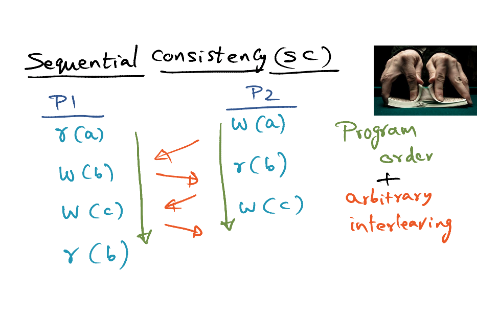
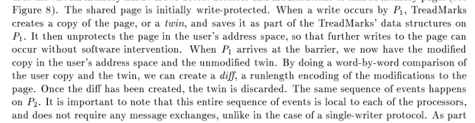

# DSM (Distributed Shared Memory)

[C. Amza, A. Cox, S Dwarkadas, P Keleher, H Lu, R. Rajamony, W. Yu and W. Zwaenepoel, " TreadMarks: Shared Memory Computing on Networks of Workstations " IEEE Computer, February, 1996.](https://gatech.instructure.com/courses/297032/files/36092659/download)

## Cluster as Parallel Machine 

### Cluster as a Parallel Machine (Sequential Program)

- Automatic Parallelisation
- High Performance Fortran 
  - User writes **directives** 
  - Compilers compiled into parallel programs 
  -  Works well for data parallel programs 

### Cluster as a Parallel Machine (Message Passing)

Explicitly parallel program

- no physically shared memory (MPI/PVM/CLF)
- Downside: difficult to program / need to change the way of thinking how to structure a program

### Cluster as a Parallel Machine (Distributed Shared Memory)

- DSM Abstraction that gives illusion that all the memory is shared, sharing pointers across entire cluster
- No need for marshalling and unmarshalling arguments due to the fact that there's a shared memory

## History of Shared Memory Systems

## Shared Memory Programming 

Synchronisation Primitives

- **Lock** (Mutual Exclusion Lock)
- **Barrier** 

2 Types of Memory Accesses

- Normal r/w to **shared data**
- r/w to **synchronisation** variables 

### Memory Consistency and Cache Coherence

- Memory Consistency Model => When? (The promises)

- Cache Coherence Mechanisms => **How**? 

### Sequential Consistency (SC)

- Program order has to be preserved
- Arbitrary Interleaving 

#### SC Memory Model

### Typical Parallel Program 

- Access to variable `a` and `b` are associated to the lock `L` => This is the critical section
- Mutually exclusive lock => Either P1 and P2 can get the lock at one time
- SC memory model does not know about the association betwen a, b and lock L
  - The cache coherence for `a` and `b` is an overhead => reduce the scalability

### Release Consistency (RC)

- Every critical section consists of acquire, data access, and release
- If P1:r1 happens before P2:a2, all that we have to ensure all **coherence actions** prior to P1:r1 should be complete before P2:a2. 
- Barriers: 
  - **Arriving barrier == acquire;**
  - **Leave barrier == release;**
  - Before leaving barrier, we have to ensure any changes made to the shared data structures have to reflected to the all other processes through cache coherence mechanisms. 

#### RC Memory Model

- Distinguished between normal data accesses & sync data accesses
- For normal r/w data accesses, it doesn't block the r/w data accesses. It starts initiating the coherence actions but it won't block the processes for the coherence actions to be completed until it encounters a synchronisation with is a release operation.   

#### RC Memory Example

### Advantages of RC over SC

### Lazy RC (LRC)

- **Eager RC**:  At the point of release, you ensure the whole system is cache coherent, then only release the lock.  
- Procrastination can often result in better performance. 
- **Lazy RC**: Wait till acquire actual happens. Take coherence action at the point of acquire. 

### Eager vs Lazy RC

<u>Eager RC</u>

- P1 releases. all changes will be broadcasted to all processes, P2 & P3 (either invalidation/update protocols)
- P2 acquire locks, make changes, then broadcast to P1 and P3 before release the lock. 
- **Push Model**

<u>Lazy RC</u>

- When release a lock, no global communication (no broadcast)
- When P2 acquire the lock, P2 pull from P1 and complete
- The number of communication actions is lower. 
- The **pull model** 

<u>Pros and cons of Lazy RC compared to Eager</u>

- Pros: Lesser communication events and less messages for coherent actions in the network
- Cons: At the point of acquisition, we don't have all the coherent actions complete. So we have to wait for the coherent actions to complete. 

## Software Distributed Shared Memory (Software DSM) 

### Software DSM

- Computational Cluster
  - Each node in the cluster has their own private physical memory, but there's no physically shared memory

- Implement coherence management at a granularity of a **page**
- Provide a **global virtual memory abstraction**
  - **Address Space Partitioned**
  - **Address equivalence** = If I access memory location X in Proc 1, it's same as accessing it in Proc 2, 3, ...N
  - **Distributed Ownership**
    - The owner of the page is responsible for consistency 
      - Use metadata to identify that the page is being shared by processes. 
- DSM Software Implementation 
  - Page fault communicated by OS to DSM 
  - DSM contact the owner of the page to get the current copy of the page
  - The **owner** knows which node current has the page 
  - DSM goes to the node and fetch the page, then bring it into the physical memory 
  - DSM contacts VM Manager, VM Manager updates page table for the thread, then the processes can resume its operation
- Single writer multiple reader protocol => can have false sharing
  - Different data structures can be on the same page. 

https://gatech.instructure.com/courses/297032/pages/19-software-dsm-cont?module_item_id=2811522

### LRC with Multi Writer Coherence Protocol 

- To allow multiple writers to write to the same page 
- Use with Lazy RC 
- OS does not know the association between L and X, Y & X
  - At the point of unlock, we compute the diffs, Xd, Yd, Zd
- When P2 acquire lock, invalidate X, Y, and Z at lock acquisition
  - When tries to access X, DSM know the X has been invalidated. 
  - DSM knows the owner of X, get the original version of the page, and get the diffs Xd, then it obtain the current version of the page for use of P2.
- Multiple data structures can exist in page X. For example, P4 is accessing L2 on page X. For P2 using Lock L, DSM will only take in modifications related to lock L. 

### Implementation

- When process tries to write to a page X, the process will make a twin. The original copy is writable. The twin is additional copy of the same page. 
- The thread reaches the **release point**. The DSM compute the difference between the **original** version (with modifications) & the twin. The difference computed as runlength encoded diff. 
- All other X is invalidated at the acquisition. 
- After that, we will write protect the original page, and get rid of the twin after the release. 

### Non-Page Based DSM 

- Have to track individual read/writes
- **Library-based**
  - Annotate shared **variables** => No false sharing
  - At the point of access, we trap into the DSM to handle it
  - No OS support
- **Structured DSM** 
  - Programming library that provides abstractions using API calls during language runtime
  - Coherence actions on API calls 
  - No OS support 

## Scalability

## Speedup

- Pointer code can increase overheads using DSM as a vehicle for programming

