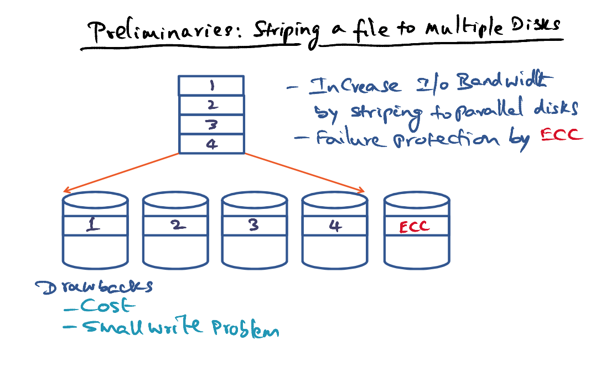
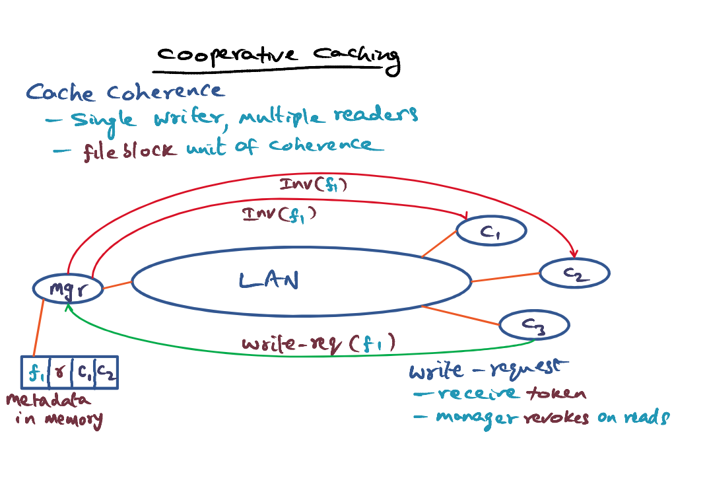

# DFS (Distributed File System)

Network File System

[Anderson, T. et al., " Serverless Network File System ", ACM Transaction on Computer Systems, February 1996.](https://gatech.instructure.com/courses/297032/files/36092475/download)

Centralised Server is the bottleneck of NFS: 

- Single server field all requests from the client, and store all the data & metadata for all the files hosted on the server
- File server has to access the disk via the I/O bus => limited bus
- Limited cache

Distributed Server

- No central server
- For scalability
- Each file is distributed across several nodes
  - I/O bandwidth cummulative higher
  - Higher memory footprint (cooperative caching)
- Each client/server can interchange their roles => Serverless 

**DFS => How to use cluster memory for cooperative caching?** 

- Avoid going to disk as much as possible
- Tries to get data from peers

## Preliminaries

### Stripping a File to Multiple Disks

RAID = Redundant Array of Inexpensive Disks

- Array of disks
  - Increasing error => Compute checksum and store in the 5th disk (Error correcting code)
- A RAID partitions a *stripe* of data into N-1 data blocks and a parity block — the exclusive-OR of the corresponding bits of the data blocks. It stores each data and parity block on a different disk. The parallelism of a RAID’s multiple disks provides high bandwidth, while its parity storage provides fault tolerance— it can reconstruct the contents of a failed disk by taking the exclusive-OR of the remaining data blocks and the parity block.

### Log Structured File System

- Modification recorded as log records (changes made to the file)
- Log Segment data structure (kept in memory)
- The log segment is contiguous, we can write them sequentially to disk periodically
- Use space/time metric to determine the when to flush the log segment to disk
- Solves small write problem
- Use RAID to stripe the log files into parallel disks
- Read of a file: 
  - Fetch file from disk 
  - File system has to **reconstruct** based on log segments
  - Latency associated to read from disk
- Writing same block of file 
  - When the system overwrites a block, it adds the new version of the block to the newest log segment, creating a “hole” in the segment where the data used to reside.
  - Logs have to be cleaned periodically to ensure the no-longer-relevant logs (holes) are removed. LFS provides a *log cleaner* that creates free disk space for new log segments using a form of generational garbage collection. The cleaner coalesces old, partially empty segments into a smaller number of full segments to create contiguous space in which to store new segments.
- Journalling file system (not same as Log Structured File System) = Log files + data files 

### Software RAID

- <u>Challenges with Hardware RAID</u>

  - Small write problems => Can be overcome with the log structured file systems

  - Employing multiple hardware drives 

- Software RAID combines LFS (remove small write problem) + RAID (parallelism)
  - Log segments 
  - Stripe log segments to multiple nodes' disks
- Zebra uses a software RAID on commodity hardware (workstation, disks, and networks) to address RAID’s cost disadvantage, and LFS’s batched writes provide efficient access to a network RAID

## XFS

<u>Dynamic Management</u> 

Traditional NFS (Centralised Server)

- There can be hot spots and cold spots

XFS

- Metadata/file cache/client caching directory management is dynamically distributed
- Coorperative Client File Caching => Get from peer cache if the cache exists in other node

### Log Based Striping & Stripe Groups

- Changes written into an append-only log
- When the number of logs exceed a certain threshold, the log segments are written to the disk. 
  - The log fragments are taken to compute the parity/ECC
  - The log fragments & ECC are striped on storage servers
- If we have 100 storage server, we can only write it over 10 servers (smaller subset of storage servers) => **Stripe group**

<u>Stripe Group</u>

- avoid small write problem
  - without stripe groups, clients would stripe each of their segments over all of the disks in the system. This organization would require clients to send small, inefficient fragments to each of the many storage servers or to buffer enormous amounts of data per segment so that they could write large fragments to each storage server.
- Subsetting servers into stripe groups
- Each stripe group includes a separate subset of the system’s storage servers, and clients write each segment across a stripe group rather than across all of the system’s storage servers.
- Allow parallel client activities
- Increase availability
  - Not all servers have to work on all client requests
  - Increase throughput
  - While one client writes at its full network bandwidth to one stripe group, another client can do the same with a different group.
  - Survive multiple server failure 
    - e.g. L,M,N fails, we can still server client requests that are served by X,Y,Z
- By limiting segment size, stripe groups make **cleaning** more efficient.

###  Cooperative Caching

- Manager of file has information for a file that it manages
  - Contains state of file
- Example, 
  - a file block f1 is read by c1 and c2
  - c3 make a write requests for f1
  - file manager reads metadata and know that f1 is currently read by c1 and c2
  - file manager sends invalidation message for f1 to c1 and c2
  - c1 and c2 acknowledges
  - file manager sends to c3 that it has write priveleges
  - c3 receives a token to write, manager revokes the token for write privilege when a new read requests come in
  - Future read requests can be taken from file contents of c3 (Cooperative Caching)

### Distributed Log Cleaning 

- Log cleaning done in a **distributed** manner
- Log cleaner find segment utilization status, pick a set of segments to clean, read the live blocks from the log segments that it has chosen and write them into a new segment, then it can garbage collect the log segments
- The log cleaning activity happen concurrently with write
- Clients and servers are all responsible for log cleaning. 
- Each stripe group is responsible for the cleaning activity in the set of servers. 
  - The stripe group has a leader. The leader is responsible for assigning the cleaning services to a member. 
  - The Manager is responsible for integrity of the file (metadata management). 
    - Responsible for resolving conflicts that may arise between client updates that want to change file segments and the cleanup functions that want to garbage collect the set of log segments

## Implementation of XFS

Unix File systems 

- i-node data structure gives mapping between filename and the data blocks on the disk

### XFS Data Structures

- Metadata management is not static

- The roadmap 

  - Client node consults Manager Mapped Data Structure, `mmap` with the filename to find the metadata manager. 

  - Manager Node: 

    - looks up `File Dir`, which has the inode number `i-number` for each filename. (filename -> i-number)

    - From `i-number`, it uses the `i-map` data structure to get the `i-node address`. (i-number -> i-node address)
      - i-node address is the inode address for the log segment associated with the filename

    - the `stripe group maps` tells how a particular log segment is striped. It can locate the storage server that contains the logsegment id that is associated with the filename (i-node address -> Storage Server)
    - Then we can get the storage servers from the stripe group map 
    - Lastly we can get the data blocks from the storage servers

### Client Reading a File Own Cache

- When starting with the {filename, offset}, we look up the directory to get the index # and offset
- File has been accessed before, most likely it will be in your client node's Unix Cache

- Hopefully this is the common case

### Client Reading a File - Get from Peer Cache

- The file is not found in the local cache

- The Manager Map data structure is replicated in every client. 
- If the file is not found on local cache, we consult mmap on local memory, which tells us the manager that we have to contact to get the file. It involves a network hop. 
- Manager has been accessed by a different client (check based on metadata). 
- A network hop to the peer to request for a file. 
- The data comes from the cache of a peer (1 more network hop). 

### Client Reading a File - The real Long way!

- Manager looks up the metadata and found that nobody has the cache of the file. 
- Manager has to pull up the file from disk. 
- Manager looks up imap amd stripe group map data structure to find the location of inode that corresponds to the log segments for the file. 
- Then, we can go to the storage server to get the index node of the logseg id of the requested data block. (might be able to get rid of this if it has been accessed by manager)
- Then, manager looks up the stripe group map to get the storage servers that have the log segment stripes. (might be able to get rid of this if it has been accessed by manager)
- Then it contacts the storage servers to get the data block to client. 

### Client Writing a File

- Client aggregate all writes to logseg data structure
- After a while, it write to strip group
- Client notifies the manager

