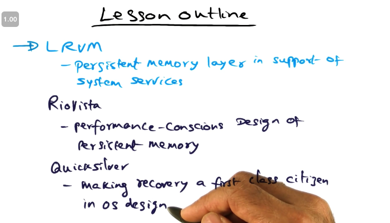

# L08a: Lightweight Recoverable Virtual Memory

[Satyanarayanan, M., et al., " Lightweight Recoverable Virtual Memory ", The Proceedings of Fourteenth ACM Symposium on Operating System Principles, pgs. 146- 160, December 1993.](https://gatech.instructure.com/courses/297032/files/36092825/download)

System crashes can happen due to power failure, hardware and software failures. 

**<u>Lesson outline:</u>** 

- LRVM
- RioVista
- Quicksilver

### Persistence

