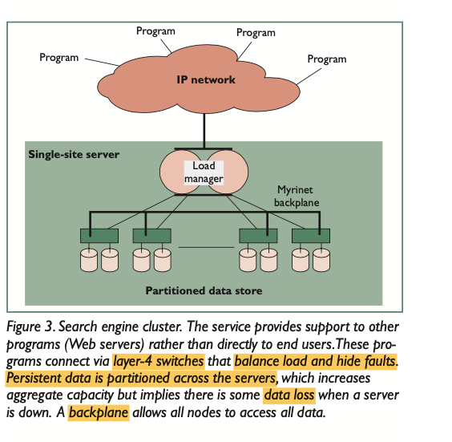
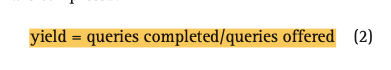
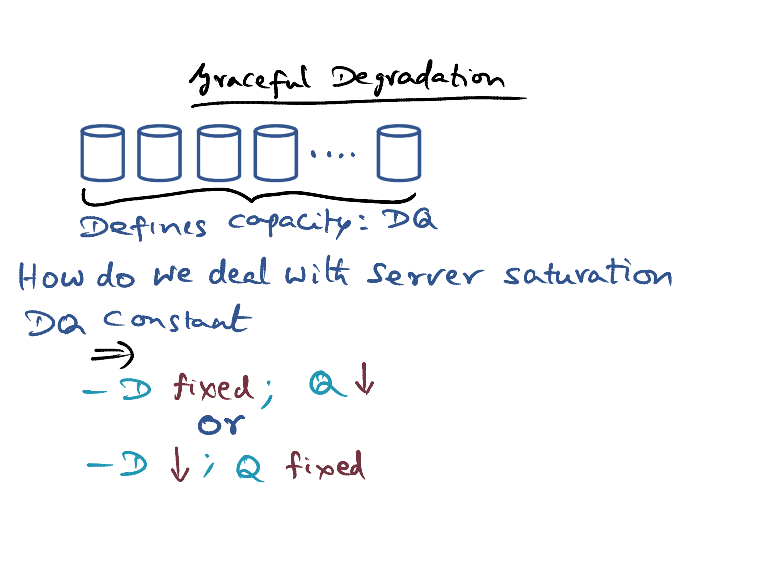

# Giant Scale Services

### Lesson Overview

### Generic Service Model of Giant Scale Services

- Server communicates with each other via the communication backplane.
- Each server can handle the server.
- Load manager redirects & balance the client traffic among all the servers.
- Client requests can be handled in parallel as long as there is enough capacity to handle them. 
- Load manager responsible to hide partial failures.

### Clusters as Workhorses

- Number of nodes scaled by 10x to 100x today compared to Circa 2000
- Each node can itself be a SMP
- Computational cluster: 
  - help to control cost & performance
  - independent components -> can change some parts
  - incremental scalability

### Load Management Choices

- Load management can be done at any of the 7 layers in the OSI model

### Load Management at Network Level

- Clients redirected to different services
- Assumptions: All servers are identical, the data are replicated

- Pros: good load balance 
- Cons: it cannot hide down server nodes

### Load Management at Transport Level

- Layer 4 switches / switch-pairs
- Can dynamically isolate down server nodes from outside world
- More intelligence in layer 4 switches
- Load manager can know the device characteristics (e.g. smartphone)
- Data can be partitioned among the servers => If the server that is holding the particular data is down, data loss is possible
  - Replicate for redundancy can help
- Server can communicate with other servers through the communication backplane

### DQ Principle

- Server has all data Df (full data set) for handling any incoming requests
- Q0 = offered load 
- Qc = the completed request

- DQ is a system constant that is the system capacity, a system limit
- We can increase the Q if we decrease D; or vice versa. 
  - Serve more queries with less data
  - Serve less queries with more data
- We can either sacrifice Q or D
- IOPS (IO operations per second)
- Giant scale -> load is network bound, not IO bound
- **Uptime (MTBF/MTTR)** 
  - MTBF: Mean time between failure
  - MTTR: mean time to repair
  - Uptime = (MTBF-MTTR)/MTBF ~0.9999 (as close to 1 as possible)

​	

### Replication vs Partitioning 

- Replication: 
  - Harvest unchanged, we can redirect the request to another server
  - Yield is lower. Service is unavailable to some users at some time. 
- Partition: 
  - Some service fails: harvest down, some portion of data is unavailable
  - Q unchanged, we can serve the same number of requests, just the data result is not that good. Each query will be serviced, but they will each get a portion of the data. 
- Assume that D is cheap in giant scale services.
- Failures are bound to happen. Choose replication instead of partition => User usually prefers complete data although service is down for a short time. (example, email service)
- However, for searches/web caches, we can have partial data. Harvest is not so important. 

### Graceful Degradation

- DQ constant
- When server is saturated, we can choose
  - D fixed, Q decrease
  - D decrease, Q fixed
- Cost based admission control
- Priority or value based admission control
- Reduce data freshness

### Online Solution and Growth

