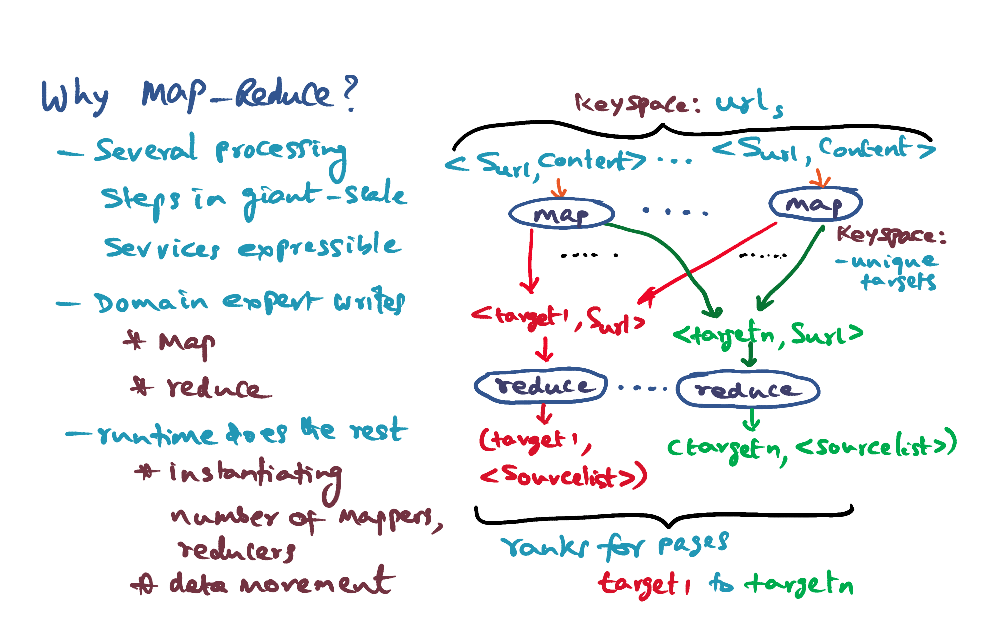

# MapReduce

[Dean, J., and Ghemawat, S. "MapReduce: Simplified Data Processing on Large Clusters"](https://gatech.instructure.com/courses/297032/files/36092361/download)

### MapReduce

### Why Map-Reduce? 

- Several processing steps in giant-scale services expressible as mapreduce. Example: Seats availability in different airlines on different dates, access frequency of API, word frequencies for document searches, page ranking during search (based on popularity of searches)
- Embarrasingly parallel
- Work on big data set
- Domain expertise in map and reduce
- heavy lifting is done by the programming framework, domain expert just need to write the map and reduce function

### Heavy Lifting Done by the Runtime

- Programming library splits the input key values into M splits 
  - M can be automatically determined by the framework or specified by user
- Spawn the master and the worker threads (involved in map and reduce functions)
- Master orchestrates work & keep track of which worker is doing what work, when are they done, when to start new work, etc
- Master assign some number of threads as mapper worker threads (corresponds to **number of splits M**), and some as **reduce worker threads**
  - The number of reduce worker threads, R, is specified by the user 

- Master plumbs mapper to reducers
  - Map produces the output
  - Output from map is consumed by the reducer

- <u>**Map Phase:**</u> 
  - Each worker work on a particular split, read from local disk, parse/reads the input
  - call the user defined map function 
  - intermediate key value pairs will be bufferred in memory
  - periodically the intermediate results will be written to files on local disks of the workers
  - Each map worker is going to produce R intermediate files
  - Worker inform master when they are done
- <u>**Reduce Phase:**</u>
  - Master knows that all map tasks are done, so they start the reduce phase
  - Reduce workers pull data from M mappers that store data (remote read using RPC)
  - Once get all the data, sort it -> sort input from different mappers, so that all the same keys are together
  - Calls the user-supplied reduce function written by the domain expert
  - Each reducer will write to the final output files
  - Once each worker is done, it informs the master that they are done

- Finally the user program can be woken up when all the reduce tasks are complete
- There might not be M+R workers available. The number of M file shards splits might be greater than the number of workers available. The number of R reducer splits might be greater than the number of workers available. 
- The master have to handle the assigning task. When the worker is done, the master assign another task to it. 

### Issues to be Handled by the Runtime

The master data structure: 

- Location of files created by the completed mappers
- Score board of mapper/reducer assignment
  - What are they executing
  - When are they done?
- Fault tolerance
  - Start new instances if **no timely response** (maybe link is down/node is down?)
    - Assume the node is dead and start new instance
  - Completion message from redundant strangglers => Master have to filter them out and **ignore** the redundant work. The tasks should be **idempotent** so that the fault tolerance can work. Even the same map function is being worked on twice, we can just ignore the redundant work. 
- Locality management: Google filesystem. Effeciently data can be mapped from mapper to reducer. Conserve network bandwidth by taking advantage of local disk storage for input data
- Task granularity:
  - Divide map phase into M pieces and reduce phase into R pieces, ideally both much larger than the number of worker machines for dynamic load balancing and recovery from failures
- Backup tasks: When a MapReduce operation is close to completion, the master schedules backup executions of the remaining *in-progress* tasks. The task is marked as completed whenever either the primary or the backup execution completes.
- Partitioning function using hashing 
- Ordering guarantees have to be implemented by user
- Combining/Partial merging 
  - e.g. Count number of "Kishore" in the input file

### Conclusion

- First, the Mapreduce model is easy to use, even for programmers without experience with parallel and distributed systems, since it hides the details of parallelization, fault-tolerance, locality optimization, and load balancing. 
- Second, a large variety of problems are easily expressible as MapReduce computations.
- Third, we have developed an implementation of MapReduce that scales to large clusters of machines comprising thousands of machines.
- Network bandwidth is a scarce resource. Locality optimization: 
  - locality optimization allows us to read data from local disks,  
  - writing a single copy of the intermediate data to local disk saves network bandwidth.
- Redundant execution can be used to reduce the impact of slow machines, and to handle ma- chine failures and data loss.

