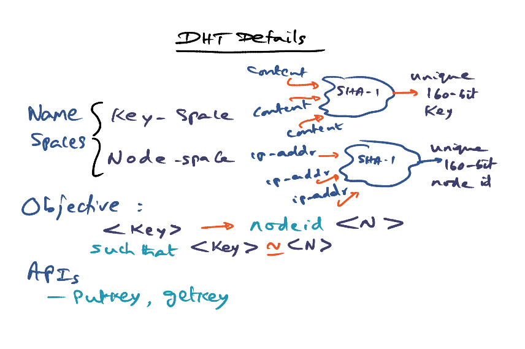
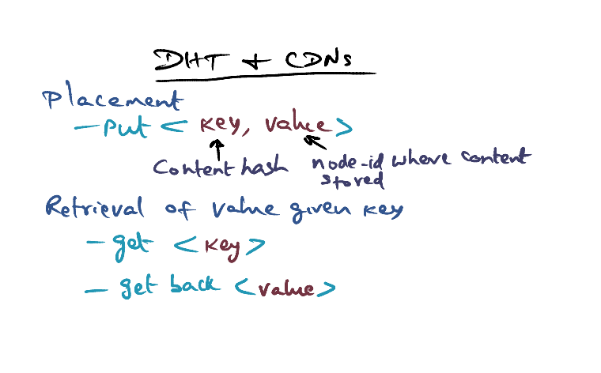

# Content Delivery Network (CDN)

### Content Distribution Networks

[Freedman, M., Freudenthal, E., and Mazières, D. "Democratizing content publication with Coral"](https://gatech.instructure.com/courses/297032/files/36092943/download)

### Distributed Hash Table (DHT)

What is Content Distribution Network? 

- `<key, value>` 
  - Content hash (key) => unique key of the content
  - Value: the node id where the content is stored
- Where to store the key-value pair? 
  - Central server is not scalable
  - **DHT (Distributed hash table)**
    - <149, 80>: 149 is close to 150, from 150 you will get the key-value pair, and know that the content is stored in node 80, and we can get the content from node 80

- Content --> SHA-1 --> **unique key** 
- IP address --> SHA-1 --> **unique node id**
- <key> --> nodeid <N>
  - such that <key> ~= <N>
- putkey (<key, value>) , getkey(key) 

### Overlay Networks (CDN)

- Map virtual address to actual IP address
- Construct a user level routing table (contain node ids of friends, friends of friends, etc)

- At OS level, IP (TCP/IP) network is an overlay on LAN
- At app level, CDN is an overlay on top of TCP/IP

### DHT and CDN

- put <key, value>
- get <key> : returns <value>

### Traditional Approach (Greedy)

What if I want to go to a node that is not in the routing table yet? 

- e.g. 58/59, in my routing table, we have 60. => communicate with 60 (and hope that 60 knows how to communicate with node 58/59)

#### Greedy Approach Leads to Metadata Server Overload

- Issue 1: 150 is the closest id for all the nodes 148, 149, 152, 153 => Tree saturation problem

- Issue 2: If everyone wants to retrieve a particular content stored at 149, they will all go to 150 (popular content) => congestion at metadata server 

#### Origin Server Overload

- Content overload because some content become very popular and everyone wants to get the content
- 2 Solutions: 
  - Web proxy (a cached content) => If everyone wants to get the dynamic content (breaking news/live programming), this is not good enough (i.e. slashdot effect)
  - CDNs: 
    - **Content mirrored** from origin server to geographical area
    - User request dynamically re-routed to geo-local mirror
    - e.g. Akamai

Coral System solves 2 Issue: 

- Avoid tree saturation effect
- Avoid origin server overload

### Coral System 

#### Greedy Approach Leads to Tree Saturation

- Coral approach use K~=N as a hint, not absolute

#### Greedy Approach

- If I am looking at key K, dot (4), the nearest node is 5
- Ask node 5 whether it has a way to go to 4, if have, then that's it
- Objective: reaching destination with the minimum number of hops ("me first" approach)

#### Coral Key-based Routing

- Not being greedy, we slowly progress to the destination
- XOR distance: 
  - 14 XOR 4 = 10
  - 13 XOR 4: 9
  - 5 XOR 4 : 1
- Routing table has the XOR distance from desired destination
- In each hop, we go to the node that is **half the distance to dst** in node-id namespace
  - 1st hop: 14 XOR 4: 10 => 10/2 = 5 distance
  - 2nd hop: ... = 2 distance
  - 3rd hop: .... = 1 distance 

- Target for 1st hop: 14 XOR 4 = 10 => 10/2=5 
- There is no node at 5, we go to 4 and RPC for the half distance to node 4
- 0 XOR 4 = 4: 4/2 = 2 
-  The routing table evolves with the updated entry {4, 5, 7}
- Go to node with distance = 2 => not found => go to node 5 (closer) 

#### Coral Sloppy DHT

- Coral uses a sloppy storage technique that caches key/value pairs at nodes whose IDs are close to the key being referenced. These cached values reduce hot-spot congestion and tree saturation throughout the indexing in- frastructure: They frequently satisfy put and get requests at nodes other than those closest to the key. This charac- teristic differs from DHTs, whose put operations all pro- ceed to nodes closest to the key.

**The Insertion Algorithm.**

- **put(key, value)** 
  - Key: content hash
  - Value: node-id of proxy with the content for key
- Ideally, we want to store it in N~= key, but we want to do it without causing any metadata overlaod
  - 2 states: full, loaded
    - **full** - a particular node store max *l* values for keys
    - **loaded** - max *B* request for key 
  - A node is *full* with respect to some key k when it stores l values for k whose TTLs are all at least one- half of the new value.
  - A node is *loaded* with respect to k when it has received more than the maximum *leakage rate* β re- quests for k within the past minute.

In the **forward** phase, Coral’s routing layer makes repeated RPCs to contact nodes successively closer to the key. Each of these remote nodes returns (1) whether the key is loaded and (2) the number of values it stores under the key, along with the minimum expiry time of any such values. The client node uses this information to determine if the remote node can accept the store, potentially evicting a value with a shorter TTL. This forward phase terminates when the client node finds either the node closest to the key, or a node that is full and loaded with respect to the key. The client node places all contacted nodes that are not both full and loaded on a stack, ordered by XOR distance from the key.

During the **reverse** phase, the client node attempts to insert the value at the remote node referenced by the top stack element, *i.e.*, the node closest to the key. If this operation does not succeed—perhaps due to others’ insertions—the client node pops the stack and tries to insert on the new stack top. This process is repeated until a store succeeds or the stack is empty.

This two-phase algorithm avoids tree saturation by storing values progressively further from the key

**The Retrieval Algorithm.** 

To retrieve the value associ- ated with a key k, a node simply traverses the ID space with RPCs. When it finds a peer storing k, the remote peer returns k’s corresponding list of values. The node ter- minates its search and get returns. The requesting client application handles these redundant references in some application-specific way, *e.g.*, *CoralProxy* contacts mul- tiple sources in parallel to download cached content.

### Coral In Action

- Naomi wants to put <100, 30> to node 100
- Use coral based routing and store it

- Jacques make bunch of RPC calls, finally reach David node 100, 30 has the content

- Jacques download content from 30, Naomi sends to content 

- Jacques serves as a proxy for Naomi
- Jacques put <100, 60>, David doesn't want to store more than 1 copy for it
- The middle guy becomes the new metadata server for <100, 60>

- Kamal wants to get(100), and hit the intermediate node <100, 60>
- Kamal gets the content from Jacques => the origin server is not overloaded

- Another intermediate node <100, 75> can now serve the metadata for key 100

